# DesnseNet (121 / 169 / 201 / 264) Implemented from Scratch

This project implements and trains the **DenseNet (Densely Connected Convolutional Network)** family—specifically **DenseNet-121, DenseNet-169, DenseNet-201, and DenseNet-264** from scratch in PyTorch for fine-grained butterfly classification.

The architecture follows the principle of **feature reuse**, where each layer receives the concatenated feature maps of all preceding layers within a dense block. This design significantly reduces the vanishing gradient problem and encourages the network to learn more compact and efficient representations.

---

## Hardware

- GPU: 2x Nvidia T4 (Kaggle Notebook)
- Strategy: Distributed training using `DataParallel` to handle the memory overhead of dense connections at a 224x224 resolution.

---

## Dataset

Butterfly

https://www.kaggle.com/datasets/gpiosenka/butterfly-images40-species

```
data/butterfly/
├── train/
│   ├── ADONIS/
│   ├── AFRICAN GIANT SWALLOWTAIL/
│   └── ...
└── test/
    ├── ADONIS/
    ├── AFRICAN GIANT SWALLOWTAIL/
    └── ...
```

- Image size: 224×224
- Normalization: mean=[0.6434,0.5508,0.4839], std=[0.3289,0.3746,0.4001]
- Batch size: 32 (Total across both GPUs)
- Num Workers: 4
- Classes: 100

## Model

### DenseNet Architecture

- Initial Convolution: 7x7 conv with stride 2, followed by 3x3 max pooling.
- Dense Blocks: Layers are connected such that each layer $H_{\ell}$ receives all feature maps from $0$ to $\ell-1$ as input.
- Bottleneck Layers: 1x1 conv used before each 3x3 conv to improve computational efficiency.
- Transition Layers: 1x1 conv (compression) and 2x2 average pooling to reduce spatial dimensions between blocks.
- Growth Rate ($k$): Set to 32 (each layer outputs 32 feature maps).

### Depth & Configuration

| Model | Block Configuration | Total Layers |
| :--- | :--- | :--- |
| DenseNet-121 | (6, 12, 24, 16) | 121 |
| DenseNet-169 | (6, 12, 32, 32) | 169 |
| DenseNet-201 | (6, 12, 48, 32) | 201 |
| DenseNet-264 | (6, 12, 64, 48) | 264 |

## Training

- Optimizer: SGD with momentum (0.9)
- Weight decay: 5e-4
- Learning Rate: 0.01
- Scheduler: StepLR (decay every 30 epochs, $\gamma = 0.1$)
- Loss: CrossEntropy
- Epochs: 50
- Resume Support: `start_from` parameter available (default: None)

## Results

### DenseNet-121

**Model Statistics:**
- Total parameters: 7,056,356  
- Trainable parameters: 7,056,356  
- Approximate size: 26.92 MB  
- GPU Memory Allocated: 317.35 MB  
- GPU Peak Memory Allocated: 326.42 MB  

**Accuracy:**
- Top-1: 63.00%  
- Top-5: 87.20%  

**Top 10 most confused class pairs (true → predicted):**
- SOOTYWING → BANDED PEACOCK : 4  
- ARCIGERA FLOWER MOTH → LUNA MOTH : 3  
- GREAT JAY → CAIRNS BIRDWING : 3  
- ZEBRA LONG WING → LUNA MOTH : 3  
- ADONIS → CHALK HILL BLUE : 2  
- AMERICAN SNOOT → CLODIUS PARNASSIAN : 2  
- ATLAS MOTH → HERCULES MOTH : 2  
- BLUE MORPHO → ULYSES : 2  
- BROOKES BIRDWING → CAIRNS BIRDWING : 2  
- EASTERN COMA → BANDED PEACOCK : 2  

**Training Time:**
- Average epoch time: 0h 1m 57s  
- Total training time: 1h 38m 4s  


### DenseNet-169

**Model Statistics:**
- Total parameters: 12,650,980  
- Trainable parameters: 12,650,980  
- Approximate size: 48.26 MB  
- GPU Memory Allocated: 382.91 MB  
- GPU Peak Memory Allocated: 391.31 MB  

**Accuracy:**
- Top-1: 66.20%  
- Top-5: 87.60%  

**Top 10 most confused class pairs (true → predicted):**
- SOOTYWING → BANDED PEACOCK : 4  
- GARDEN TIGER MOTH → BANDED TIGER MOTH : 3  
- GREAT JAY → MADAGASCAN SUNSET MOTH : 3  
- HUMMING BIRD HAWK MOTH → CLEARWING MOTH : 3  
- INDRA SWALLOW → SCARCE SWALLOW : 3  
- ARCIGERA FLOWER MOTH → COMMON BANDED AWL : 2  
- ATLAS MOTH → HERCULES MOTH : 2  
- BLUE MORPHO → OLEANDER HAWK MOTH : 2  
- BLUE MORPHO → PURPLE HAIRSTREAK : 2  
- BROOKES BIRDWING → CAIRNS BIRDWING : 2  

**Training Time:**
- Average epoch time: 0h 2m 36s  
- Total training time: 2h 10m 0s  


### DenseNet-201

**Model Statistics:**
- Total parameters: 18,285,028  
- Trainable parameters: 18,285,028  
- Approximate size: 69.75 MB  
- GPU Memory Allocated: 447.12 MB  
- GPU Peak Memory Allocated: 456.87 MB  

**Accuracy:**
- Top-1: 86.40%  
- Top-5: 98.40%  

**Top 10 most confused class pairs (true → predicted):**
- COPPER TAIL → PURPLISH COPPER : 4  
- EASTERN PINE ELFIN → TROPICAL LEAFWING : 2  
- WHITE LINED SPHINX MOTH → OLEANDER HAWK MOTH : 2  
- BANDED TIGER MOTH → GARDEN TIGER MOTH : 1  
- BIRD CHERRY ERMINE MOTH → GIANT LEOPARD MOTH : 1  
- BLUE MORPHO → ULYSES : 1  
- BLUE SPOTTED CROW → GREAT EGGFLY : 1  
- BLUE SPOTTED CROW → STRAITED QUEEN : 1  
- BLUE SPOTTED CROW → DANAID EGGFLY : 1  
- BROOKES BIRDWING → GREEN CELLED CATTLEHEART : 1  

**Training Time:**
- Average epoch time: 0h 3m 2s  
- Total training time: 2h 31m 47s  


### DenseNet-264

**Model Statistics:**
- Total parameters: 30,917,604  
- Trainable parameters: 30,917,604  
- Approximate size: 117.94 MB  
- GPU Memory Allocated: 484.56 MB  
- GPU Peak Memory Allocated: 492.99 MB  

**Accuracy:**
- Top-1: 88.40%  
- Top-5: 98.40%  
- Highest test accuracy: 88.40% (epoch 30)

**Top 10 most confused class pairs (true → predicted):**
- COPPER TAIL → PURPLISH COPPER : 3  
- BANDED TIGER MOTH → GARDEN TIGER MOTH : 2  
- QUESTION MARK → EASTERN COMA : 2  
- ATLAS MOTH → HERCULES MOTH : 1  
- BANDED PEACOCK → ULYSES : 1  
- BECKERS WHITE → LARGE MARBLE : 1  
- BIRD CHERRY ERMINE MOTH → GIANT LEOPARD MOTH : 1  
- BLUE MORPHO → ULYSES : 1  
- BLUE SPOTTED CROW → GREAT EGGFLY : 1  
- BLUE SPOTTED CROW → ARCIGERA FLOWER MOTH : 1  

**Training Time:**
- Average epoch time: 0h 3m 54s  
- Total training time: 3h 15m 1s  

### ResNet-50

**Model Statistics:**
- Total parameters: 23,739,492  
- Trainable parameters: 23,739,492  
- Approximate size: 90.56 MB  
- GPU Memory Allocated: 511.77 MB  
- GPU Peak Memory Allocated: 539.10 MB  

**Accuracy:**
- Top-1: 74.60%  
- Top-5: 90.00%  

**Top 10 most confused class pairs (true → predicted):**
- AFRICAN GIANT SWALLOWTAIL → GLITTERING SAPPHIRE : 3  
- GREEN CELLED CATTLEHEART → BROOKES BIRDWING : 3  
- BECKERS WHITE → LARGE MARBLE : 2  
- CAIRNS BIRDWING → GLITTERING SAPPHIRE : 2  
- CLODIUS PARNASSIAN → APPOLLO : 2  
- CLOUDED SULPHUR → CLEOPATRA : 2  
- EMPEROR GUM MOTH → GLITTERING SAPPHIRE : 2  
- JULIA → ORANGE TIP : 2  
- MADAGASCAN SUNSET MOTH → GLITTERING SAPPHIRE : 2  
- SOOTYWING → COMMON WOOD-NYMPH : 2  

**Training Time:**
- Average epoch time: 0h 1m 36s  
- Total training time: 1h 20m 15s  


### ResNet-101

**Model Statistics:**
- Total parameters: 42,757,732  
- Trainable parameters: 42,757,732  
- Approximate size: 163.11 MB  
- GPU Memory Allocated: 730.36 MB  
- GPU Peak Memory Allocated: 757.70 MB  

**Accuracy:**
- Top-1: 74.20%  
- Top-5: 90.60%  

**Top 10 most confused class pairs (true → predicted):**
- SOOTYWING → COMMON WOOD-NYMPH : 3  
- BECKERS WHITE → LARGE MARBLE : 2  
- CAIRNS BIRDWING → BROOKES BIRDWING : 2  
- HUMMING BIRD HAWK MOTH → CLEARWING MOTH : 2  
- JULIA → ORANGE TIP : 2  
- LARGE MARBLE → EASTERN DAPPLE WHITE : 2  
- MESTRA → BLACK HAIRSTREAK : 2  
- MESTRA → PAPER KITE : 2  
- ORANGE OAKLEAF → BLACK HAIRSTREAK : 2  
- ADONIS → CHALK HILL BLUE : 1  

**Training Time:**
- Average epoch time: 0h 2m 38s  
- Total training time: 2h 11m 50s  


### ResNet-152

**Model Statistics:**
- Total parameters: 58,424,420  
- Trainable parameters: 58,424,420  
- Approximate size: 222.87 MB  
- GPU Memory Allocated: 910.55 MB  
- GPU Peak Memory Allocated: 937.89 MB  

**Accuracy:**
- Top-1: 75.60%  
- Top-5: 91.60%  

**Top 10 most confused class pairs (true → predicted):**
- EASTERN DAPPLE WHITE → JULIA : 3  
- BANDED TIGER MOTH → GARDEN TIGER MOTH : 2  
- BECKERS WHITE → LARGE MARBLE : 2  
- BECKERS WHITE → CHALK HILL BLUE : 2  
- CAIRNS BIRDWING → BROOKES BIRDWING : 2  
- CLOUDED SULPHUR → SOUTHERN DOGFACE : 2  
- COPPER TAIL → PURPLISH COPPER : 2  
- MONARCH → VICEROY : 2  
- PURPLE HAIRSTREAK → BLUE MORPHO : 2  
- RED SPOTTED PURPLE → POPINJAY : 2  

**Training Time:**
- Average epoch time: 0h 3m 32s  
- Total training time: 2h 57m 17s  

## Model Comparison

| Statistic / Model                  | DenseNet-121 | DenseNet-169 | DenseNet-201 | DenseNet-264 | ResNet-50 | ResNet-101 | ResNet-152 |
|-----------------------------------|-------------|-------------|-------------|-------------|-----------|-----------|-----------|
| Total Parameters                   | 7,056,356   | 12,650,980  | 18,285,028  | 30,917,604  | 23,739,492| 42,757,732| 58,424,420|
| Trainable Parameters               | 7,056,356   | 12,650,980  | 18,285,028  | 30,917,604  | 23,739,492| 42,757,732| 58,424,420|
| Approximate Size (MB)              | 26.92       | 48.26       | 69.75       | 117.94      | 90.56     | 163.11    | 222.87    |
| GPU Memory Allocated (MB)          | 317.35      | 382.91      | 447.12      | 484.56      | 511.77    | 730.36    | 910.55    |
| GPU Peak Memory (MB)               | 326.42      | 391.31      | 456.87      | 492.99      | 539.10    | 757.70    | 937.89    |
| Top-1 Accuracy (%)                 | 63.00       | 66.20       | 86.40       | 88.40       | 74.60     | 74.20     | 75.60     |
| Top-5 Accuracy (%)                 | 87.20       | 87.60       | 98.40       | 98.40       | 90.00     | 90.60     | 91.60     |
| Average Epoch Time                 | 0h 1m 57s   | 0h 2m 36s   | 0h 3m 2s    | 0h 3m 54s   | 0h 1m 36s | 0h 2m 38s | 0h 3m 32s |
| Total Training Time                | 1h 38m 4s   | 2h 10m 0s   | 2h 31m 47s  | 3h 15m 1s   | 1h 20m 15s| 2h 11m 50s| 2h 57m 17s|

## Inference & Outputs

Each model reports:

- Top-1 accuracy
- Top-5 accuracy
- Top 10 most confused class pairs
- Confusion bar plot
- Sample images of confused pairs
- Per-class accuracy CSV
- Loss plot
- Accuracy plot
- Epoch time plot

### Saved files:

```
outputs/
├── plots/
│   ├── densenet121/
│   │   ├── densenet121_loss.png
│   │   └── ...
│   ├── densenet169/
│   │   ├── densenet169_loss.png
│   │   └── ...
│   ├── densenet201/
│   │   ├── densenet201_loss.png
│   │   └── ...
│   ├── densenet264/
│   │   ├── densenet264_loss.png
│   │   └── ...
│   ├── resnet50/
│   │   ├── resnet50_loss.png
│   │   └── ...
│   ├── resnet101/
│   │   ├── resnet101_loss.png
│   │   └── ...
│   └── resnet152/
│       ├── resnet152_loss.png
│       └── ...
└── metrics/
    ├── densenet121_per_class_accuracy.csv
    └── ...
```

### Plots

#### DenseNet-121
<div align="center">

| Loss | Accuracy | Epoch Time |
|------|----------|------------|
| 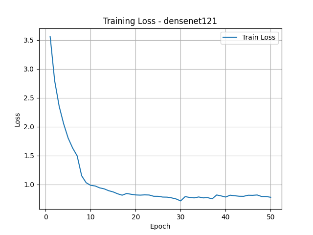 | 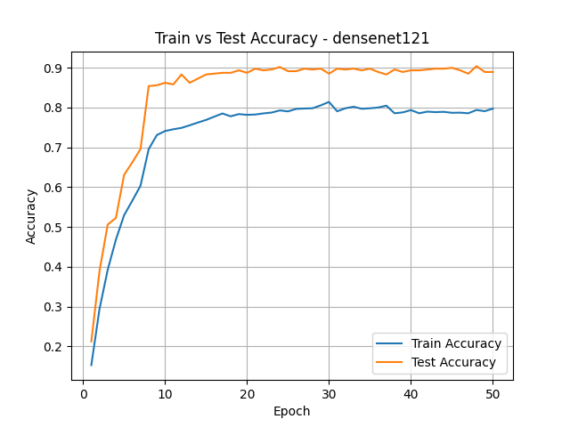 | 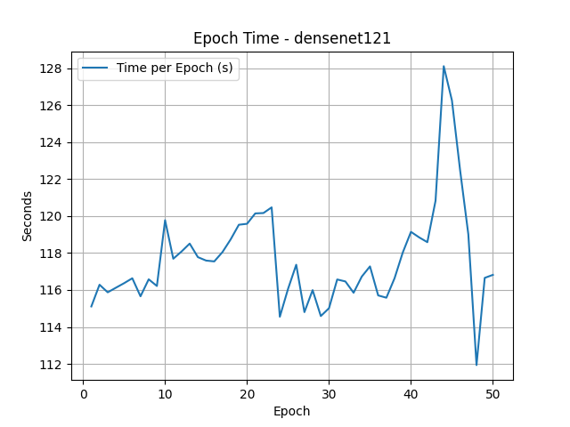 |


</div>


#### DenseNet-169
<div align="center">

| Loss | Accuracy | Epoch Time |
|------|----------|------------|
| 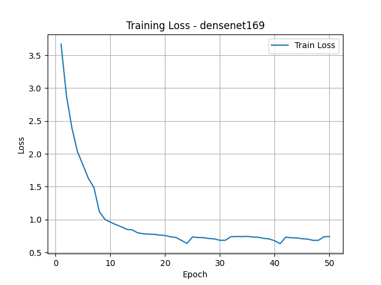 | 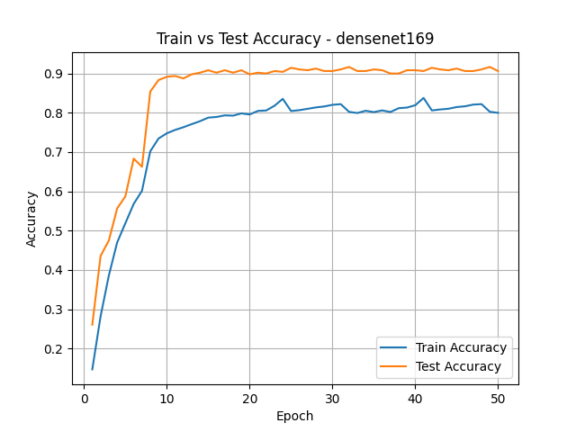 | 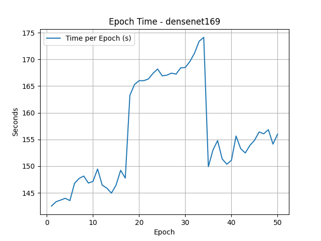 |


</div>


#### DenseNet-201
<div align="center">

| Loss | Accuracy | Epoch Time |
|------|----------|------------|
| 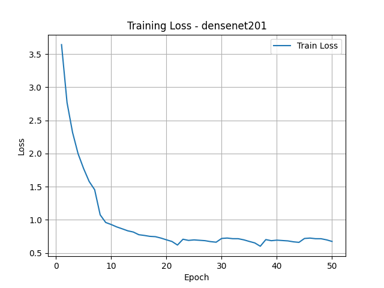 | 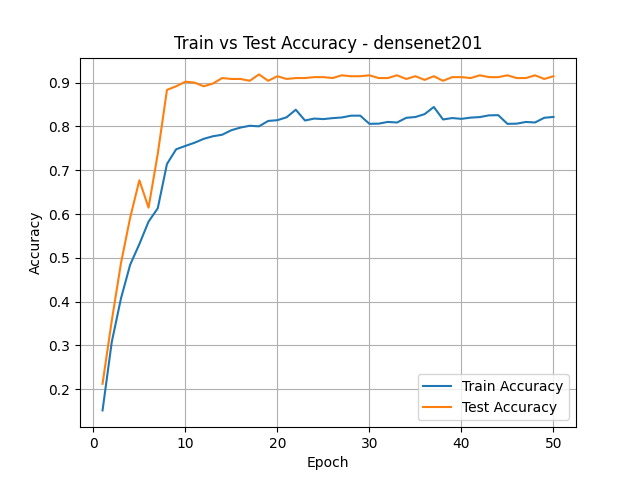 | 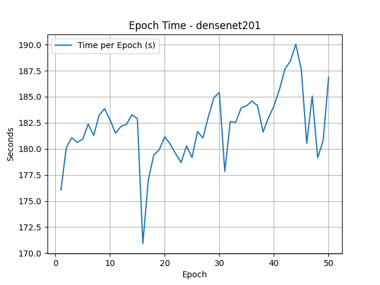 |


</div>

#### DenseNet-264
<div align="center">

| Loss | Accuracy | Epoch Time |
|------|----------|------------|
| 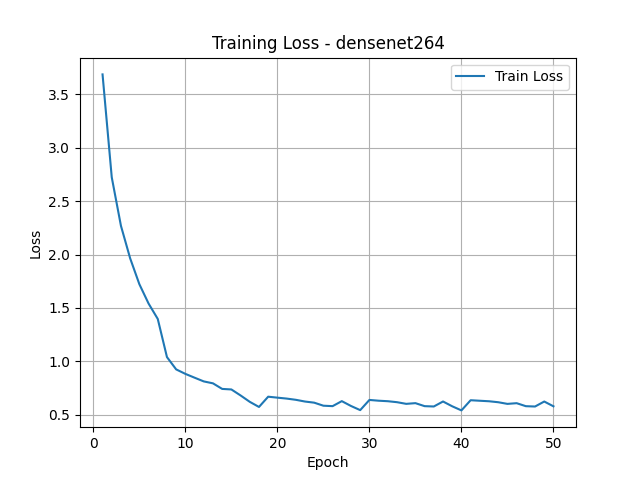 | 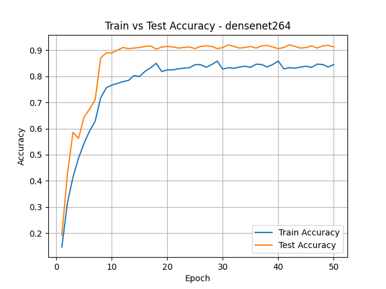 | 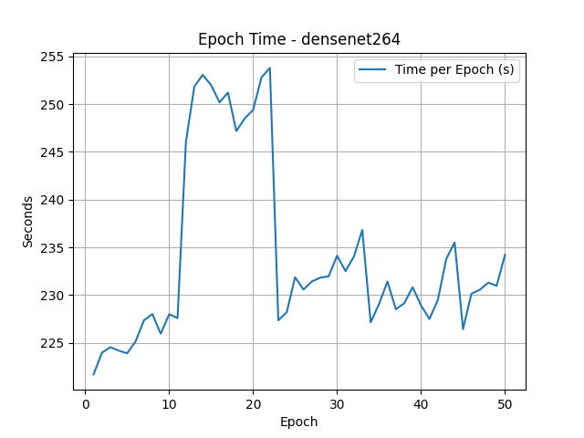 |


</div>


#### ResNet-50
<div align="center">

| Loss | Accuracy | Epoch Time |
|------|----------|------------|
| 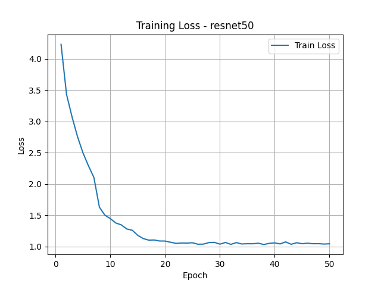 | 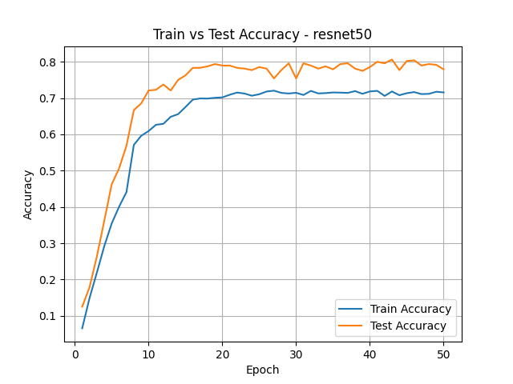 | 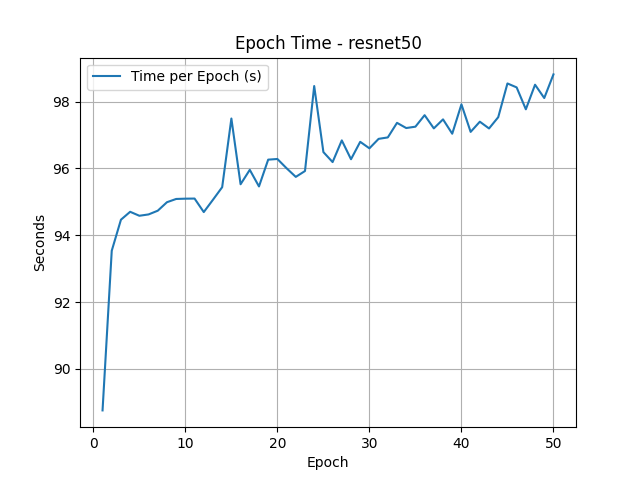 |


</div>


#### ResNet-101
<div align="center">

| Loss | Accuracy | Epoch Time |
|------|----------|------------|
| 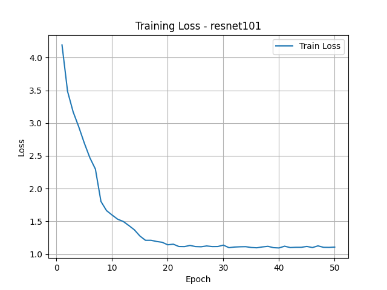 | 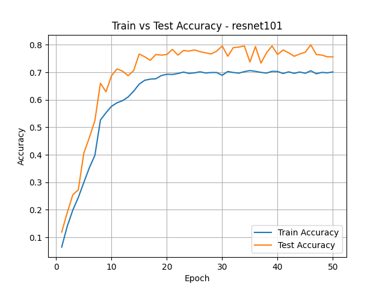 | 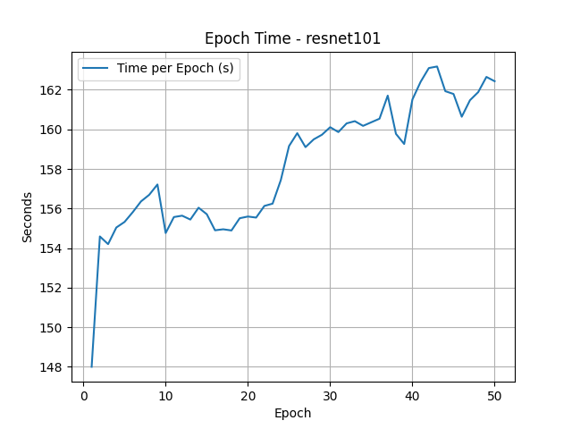 |


</div>


#### ResNet-152
<div align="center">

| Loss | Accuracy | Epoch Time |
|------|----------|------------|
| 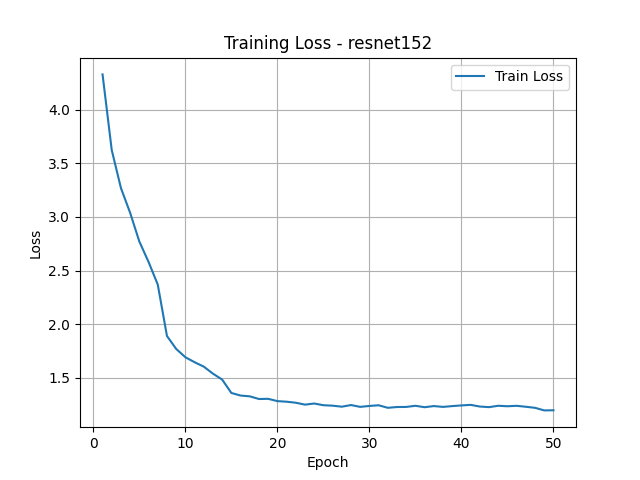 | 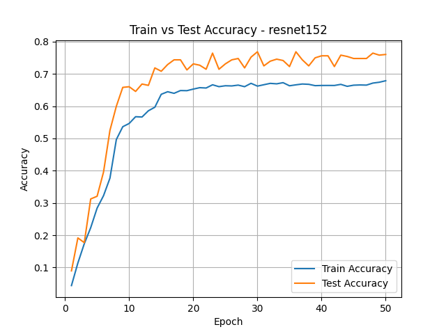 | 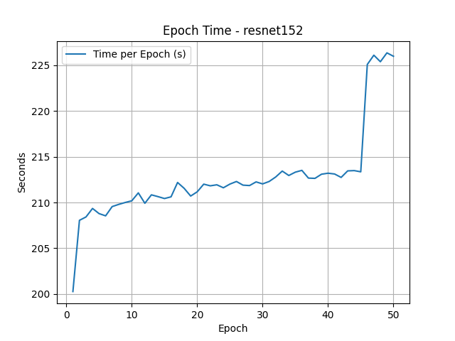 |

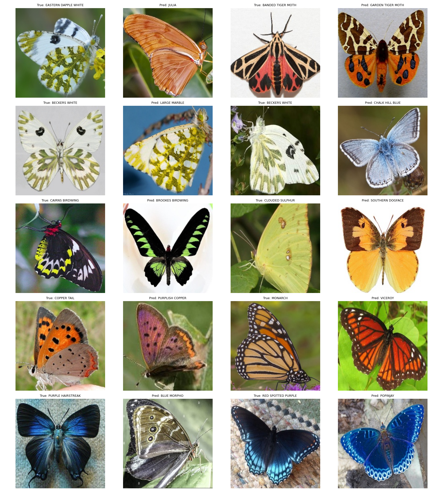

</div>

## Analysis

### Accuracy Comparison

- **Top-1 Accuracy**:
  - **DenseNet-264**: 88.4% → Best overall performance, highest accuracy across all models.
  - **DenseNet-201**: 86.4% → Very strong, slightly below 264 but much more efficient.
  - **ResNet-50/101/152**: 74–75.6% → Moderate accuracy despite significantly larger size.
  - **DenseNet-121/169**: 63% and 66% → Underfitting, insufficient depth for fine-grained classification.

- **Top-5 Accuracy**:
  - **DenseNet-201 / DenseNet-264**: 98.4% → Excellent ranking capability.
  - **ResNet family**: 90–91.6% → Decent but weaker at distinguishing similar classes.
  - **DenseNet-121/169**: ~87% → Lowest among all models.

DenseNet-264 achieves the highest accuracy, but DenseNet-201 offers nearly identical Top-5 performance with better efficiency.

### Confusion Patterns

- **DenseNet-121 & DenseNet-169**:
  - Frequently confuse highly similar species:
    - **SOOTYWING → BANDED PEACOCK**
    - **BLUE MORPHO → ULYSES**
  - Errors suggest difficulty capturing fine-grained textures and wing patterns.

- **DenseNet-201**:
  - Fewer and more subtle confusions:
    - **COPPER TAIL → PURPLISH COPPER**
    - **EASTERN PINE ELFIN → TROPICAL LEAFWING**
  - Indicates strong feature reuse and deeper semantic understanding.

- **DenseNet-264**:
  - Further reduced confusion counts:
    - Similar mistakes remain but occur less frequently (mostly count = 1–3).
  - Demonstrates best **fine-grained discrimination**, especially for near-identical species.

- **ResNet Family**:
  - Broader and more frequent confusions:
    - **SOOTYWING → COMMON WOOD-NYMPH**
    - **BECKERS WHITE → LARGE MARBLE**
  - Errors spread across many categories → weaker specialization for subtle differences.

Overall, deeper DenseNets (201/264) significantly reduce both frequency and severity of misclassifications.

### Model Size and Parameter Efficiency

| Model            | Parameters (M) | Size (MB) | Top-1 Accuracy (%) | Notes |
|-----------------|----------------|-----------|------------------|-------|
| DenseNet-121     | 7.06           | 26.92     | 63.0             | Very small, underfits |
| DenseNet-169     | 12.65          | 48.26     | 66.2             | Moderate improvement |
| DenseNet-201     | 18.29          | 69.75     | 86.4             | Excellent efficiency |
| DenseNet-264     | 30.92          | 117.94    | 88.4             | Best accuracy, higher cost |
| ResNet-50        | 23.74          | 90.56     | 74.6             | Larger but less accurate |
| ResNet-101       | 42.76          | 163.11    | 74.2             | Much larger, no real gain |
| ResNet-152       | 58.42          | 222.87    | 75.6             | Largest, inefficient |

- **DenseNet-201** = best accuracy per parameter
- **DenseNet-264** = best absolute accuracy
- ResNets are significantly less parameter-efficient

### GPU Memory Usage

| Model            | GPU Allocated (MB) | GPU Peak (MB) | Notes |
|-----------------|------------------|---------------|-------|
| DenseNet-121     | 317.35           | 326.42        | Lowest usage |
| DenseNet-169     | 382.91           | 391.31        | Moderate |
| DenseNet-201     | 447.12           | 456.87        | Efficient |
| DenseNet-264     | 484.56           | 492.99        | Slight increase vs 201 |
| ResNet-50        | 511.77           | 539.10        | Higher than DenseNet-264 |
| ResNet-101       | 730.36           | 757.70        | High |
| ResNet-152       | 910.55           | 937.89        | Extremely high |

- DenseNet-264 still uses less memory than ResNet-50
- DenseNets scale memory much more efficiently

### Training Time

| Model            | Avg Epoch Time | Total Training Time | Notes |
|-----------------|----------------|-------------------|-------|
| DenseNet-121     | 0h 1m 57s      | 1h 38m 4s         | Small, fast |
| DenseNet-169     | 0h 2m 36s      | 2h 10m 0s         | Moderate |
| DenseNet-201     | 0h 3m 2s       | 2h 31m 47s        | Good balance |
| DenseNet-264     | 0h 3m 54s      | 3h 15m 1s         | Slowest DenseNet |
| ResNet-50        | 0h 1m 36s      | 1h 20m 15s        | Fastest overall |
| ResNet-101       | 0h 2m 38s      | 2h 11m 50s        | Slower |
| ResNet-152       | 0h 3m 32s      | 2h 57m 17s        | Very slow |

- DenseNet-264 increases cost noticeably over 201
- DenseNet-201 remains the best trade-off
- ResNet-50 is fastest but sacrifices significant accuracy

---

### Overall Observations

- **Accuracy & Confusion**:
  - DenseNet-264 achieves the best results overall.
  - DenseNet-201 is nearly as strong, with fewer resources.
  - Smaller DenseNets and ResNets struggle with fine-grained distinctions.

- **Efficiency**:
  - DenseNets dominate in parameter efficiency and memory usage.
  - ResNets scale poorly in comparison.

- **Scaling Behavior**:
  - DenseNet improvements (121 → 169 → 201 → 264) show consistent gains.
  - ResNet scaling (50 → 101 → 152) shows diminishing returns.

- **Recommendations**:
  - **DenseNet-264** → Best accuracy (if compute is not a constraint)
  - **DenseNet-201** → Best overall balance (recommended default)
  - **DenseNet-169** → Mid-tier option
  - **DenseNet-121 / ResNet-50** → For constrained environments only

**Conclusion:**  
DenseNet architectures—especially **DenseNet-201 and DenseNet-264** provide the best combination of **accuracy, efficiency, and reduced confusion**, making them highly suitable for fine-grained image classification tasks.

## Running

### Local Computer

1. Prepare dataset:

```bash
python dataset.py
```

2. Train model:

```bash
python train.py
```

3. Run inference:

```bash
python inference.py
```

- Make sure to set the correct checkpoint file (e.g., `densenet_121.pth`).

### Kaggle Notebook

- Or run the provided notebook in Kaggle or Colab (update paths if needed).
- Insert your username for model and config path!
- Create a dataset named `densenet` with the three yaml files. Or simply upload it if on Colab.
- When inferencing, initialize a model named `densenet` and upload the corresponding model checkpoint parameters.
