# MobileNetV4-Conv-S Implemented from Scratch

Built MobileNetV4-Conv-S in PyTorch from the paper's architecture tables, trained it on ImageNet, and benchmarked it against ResNet-50 and DenseNet-121.

The interesting idea in MobileNetV4 is the **Universal Inverted Bottleneck (UIB)**: one block with two optional depthwise convolutions that covers the Inverted Bottleneck, ConvNext, and FFN designs, plus a new one called ExtraDW. Instead of picking a block type for the whole network, architecture search picks per layer.

The comparison with ResNet-50 and DenseNet-121 is where it got interesting. The point was to see whether parameter count and FLOPs actually predict how fast a model runs. They don't.

---

## Hardware

- GPU: NVIDIA T4 ×2 (Kaggle Notebook)
- CPU: 13th Gen Intel Core i7-1355U, 10 cores @ 1.70 GHz (local benchmarking)

## Dataset

ImageNet

https://www.kaggle.com/datasets/dimensi0n/imagenet-256

Run `dataset.py` to download and split the data, or set `DOWNLOAD = True` in the Kaggle notebook on the first run.

Once it's split, upload the `data/imagenet/` folder as a Kaggle Dataset named **`imagenet`**. Later runs can mount it directly instead of re-downloading. Worth doing, since re-running `process_data` reshuffles and gives you a different split, which would break the comparison between models.

- ImageNet-style folder structure:

```
data/imagenet/
├── train/
│   ├── abacus/
│   ├── abaya/
│   └── ...
└── test/
    ├── abacus/
    ├── abaya/
    └── ...
```

- Image size: 224×224
- Normalization: mean=[0.485,0.456,0.406], std=[0.229,0.224,0.225]
- Train augmentation: RandomResizedCrop(224), RandomHorizontalFlip
- Eval transform: Resize(256), CenterCrop(224)
- Batch size: 64, 4 workers
- Classes: 100 (to reduce computation)
- Split: 80/20 train/test

> **Note:** the test split is a holdout from the ImageNet training pool, not the official validation set. So the accuracies here aren't directly comparable to published ImageNet numbers.

## Model

### MobileNetV4-Conv-S Architecture

```
224×224×3
  Conv 3×3 s2                 -> 112×112×32   stem
  FusedIB exp32  s2           -> 56×56×32
  FusedIB exp96  s2           -> 28×28×64
  6 × UIB (first s2)          -> 14×14×96
  6 × UIB (first s2)          -> 7×7×128
  Conv 1×1                    -> 7×7×960
  Global AvgPool              -> 1×1×960
  Conv 1×1 -> 1280 -> classes
```

### Block Types

**UIB** is an inverted bottleneck with two optional depthwise slots:

```
[DW K1]      optional, before expand
PW expand
[DW K2]      optional, after expand
PW project
+ skip if stride 1 and in == out
```

Which slots you fill decides what the block actually is:

| K1  | K2  | Block            |
| --- | --- | ---------------- |
| off | on  | IB (MobileNetV2) |
| on  | off | ConvNext         |
| on  | on  | ExtraDW          |
| off | off | FFN              |

**FusedIB** folds the expansion pointwise and the depthwise into a single regular 3×3 conv. It only shows up in the first two stages, where resolution is high and there aren't many channels yet, so a dense conv keeps the hardware busier than a depthwise one would.

### Design Constraints

No Squeeze-and-Excite, no GELU, no LayerNorm. The paper drops all three because they're slow on mobile accelerators, even though SE in particular helps accuracy. ReLU only appears in the wide part of each block; the start depthwise and the projection are both linear.

### Model Sizes

| Model              | Params  | MACs    |
| ------------------ | ------- | ------- |
| MobileNetV4-Conv-S | 2.62 M  | 0.185 G |
| DenseNet-121       | 7.06 M  | 2.833 G |
| ResNet-50          | 23.71 M | 4.087 G |

Those counts are at 100 classes. At the paper's 1000, Conv-S comes out to 3.77 M, which lines up with the published 3.8 M.

## Training

Each architecture gets the recipe its family normally uses. Data, split, seed, and epoch count are the same across all three.

|                 | MobileNetV4-Conv-S      | ResNet-50 / DenseNet-121      |
| --------------- | ----------------------- | ----------------------------- |
| Optimizer       | AdamW                   | SGD + Nesterov (momentum 0.9) |
| Learning rate   | 4e-3                    | 0.1                           |
| Weight decay    | 0.01                    | 1e-4                          |
| Label smoothing | 0.1                     | 0.0                           |
| Scheduler       | 5-epoch warmup → cosine | 5-epoch warmup → cosine       |
| Epochs          | 100                     | 100                           |
| Precision       | AMP (fp16)              | AMP (fp16)                    |

- Loss: CrossEntropy
- Supports checkpoint resume (`start_from` in the model config)
- Saves `<model>_last.pth` and `<model>_best.pth`

## Results

### MobileNetV4-Conv-S

**Accuracy:**

- Top-1: 79.45%
- Top-5: 93.14%

**Top 10 most confused class pairs (true → predicted):**

- castle → palace : 11
- conch → hermit_crab : 11
- palace → castle : 11
- rhinoceros_beetle → leaf_beetle : 10
- toy_poodle → teddy : 10
- tricycle → jinrikisha : 10
- crayfish → hermit_crab : 9
- schipperke → groenendael : 9
- apron → backpack : 8
- english_springer → saint_bernard : 8

**Training time:**

- Average epoch time: 0h 1m 20s

### ResNet-50

**Accuracy:**

- Top-1: 83.31%
- Top-5: 94.67%

**Top 10 most confused class pairs (true → predicted):**

- castle → palace : 13
- groenendael → schipperke : 13
- night_snake → king_snake : 11
- palace → castle : 11
- apron → backpack : 10
- crayfish → hermit_crab : 8
- king_snake → night_snake : 8
- soap_dispenser → perfume : 8
- coffeepot → soap_dispenser : 7
- conch → hermit_crab : 7

**Training time:**

- Average epoch time: 0h 2m 58s

### DenseNet-121

**Accuracy:**

- Top-1: 83.83%
- Top-5: 94.83%

**Top 10 most confused class pairs (true → predicted):**

- palace → castle : 12
- night_snake → king_snake : 11
- groenendael → schipperke : 10
- king_snake → night_snake : 10
- castle → palace : 9
- library → palace : 9
- tricycle → jinrikisha : 9
- hermit_crab → conch : 8
- schipperke → groenendael : 8
- water_bottle → perfume : 8

**Training time:**

- Average epoch time: 0h 3m 55s

### Summary

| Model              | Params (M) | MACs (G) | Top-1  | Top-5  | Epoch time |
| ------------------ | ---------- | -------- | ------ | ------ | ---------- |
| MobileNetV4-Conv-S | 2.62       | 0.185    | 79.45% | 93.14% | 1m 20s     |
| DenseNet-121       | 7.06       | 2.833    | 83.83% | 94.83% | 3m 55s     |
| ResNet-50          | 23.71      | 4.087    | 83.31% | 94.67% | 2m 58s     |

## Latency Benchmarks

### GPU (NVIDIA T4)

| Model              | bs=1 latency | bs=1 throughput | bs=64 latency | bs=64 throughput | Peak mem (bs=64) |
| ------------------ | ------------ | --------------- | ------------- | ---------------- | ---------------- |
| MobileNetV4-Conv-S | 4.70 ms      | 213 img/s       | 18.64 ms      | 3434 img/s       | 293 MB           |
| ResNet-50          | 6.05 ms      | 165 img/s       | 175.13 ms     | 365 img/s        | 850 MB           |
| DenseNet-121       | 14.92 ms     | 67 img/s        | 181.16 ms     | 353 img/s        | 629 MB           |

### CPU, batch size 1 (13th Gen Intel Core i7-1355U, 10 cores)

| Model              | 1 thread | 4 threads |
| ------------------ | -------- | --------- |
| MobileNetV4-Conv-S | 14.8 ms  | 23.3 ms   |
| DenseNet-121       | 162.9 ms | 118.0 ms  |
| ResNet-50          | 198.2 ms | 129.5 ms  |

### Speedup relative to ResNet-50

| Model              | MACs ratio | GPU bs=64 | GPU bs=1 | CPU 1 thread |
| ------------------ | ---------- | --------- | -------- | ------------ |
| MobileNetV4-Conv-S | 22.1×      | 9.4×      | 1.3×     | 13.4×        |
| DenseNet-121       | 1.4×       | 0.97×     | 0.41×    | 1.2×         |

## Inference & Outputs

Each model reports:

- Top-1 accuracy
- Top-5 accuracy
- Top 10 most confused class pairs
- Confusion bar plot
- Sample images of confused pairs
- Per-class accuracy CSV
- Loss plot
- Accuracy plot
- Epoch time plot
- Params, MACs, GPU and CPU latency

### Saved files:

```
outputs/
├── plots/
│   ├── comparison_accuracy_vs_cost.png
│   ├── comparison_efficiency.png
│   ├── conv-s/
│   │   ├── conv-s_loss.png
│   │   ├── conv-s_accuracy.png
│   │   ├── conv-s_epoch_time.png
│   │   ├── conv-s_most_confused_pairs.png
│   │   └── conv-s_most_confused_pairs_samples.png
│   ├── resnet50/
│   │   ├── resnet50_loss.png
│   │   ├── resnet50_accuracy.png
│   │   ├── resnet50_epoch_time.png
│   │   ├── resnet50_most_confused_pairs.png
│   │   └── resnet50_most_confused_pairs_samples.png
│   └── densenet121/
│       ├── densenet121_loss.png
│       ├── densenet121_accuracy.png
│       ├── densenet121_epoch_time.png
│       ├── densenet121_most_confused_pairs.png
│       └── densenet121_most_confused_pairs_samples.png
└── metrics/
    ├── model_comparison.csv
    ├── model_profiles.csv
    ├── cpu_benchmark.csv
    ├── conv-s_per_class_accuracy.csv
    ├── resnet50_per_class_accuracy.csv
    └── densenet121_per_class_accuracy.csv
```

### Plots

#### Cross-Model Comparison

<div align="center">

| Accuracy vs Cost                                                   | Efficiency                                             |
| ------------------------------------------------------------------ | ------------------------------------------------------ |
| 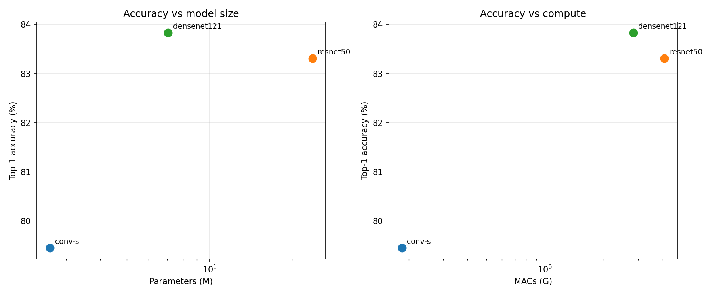 | 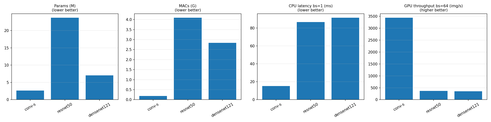 |

</div>

#### MobileNetV4-Conv-S

<div align="center">

| Loss                                                 | Accuracy                                                     | Epoch Time                                                       |
| ---------------------------------------------------- | ------------------------------------------------------------ | ---------------------------------------------------------------- |
| 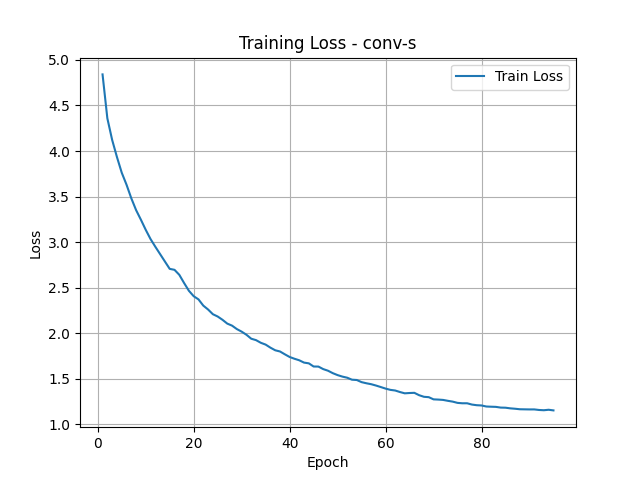 | 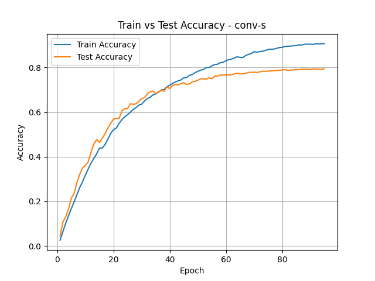 | 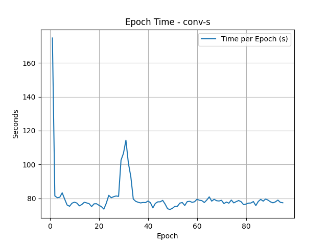 |

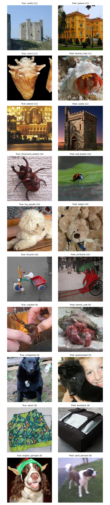

</div>

#### ResNet-50

<div align="center">

| Loss                                                       | Accuracy                                                           | Epoch Time                                                             |
| ---------------------------------------------------------- | ------------------------------------------------------------------ | ---------------------------------------------------------------------- |
| 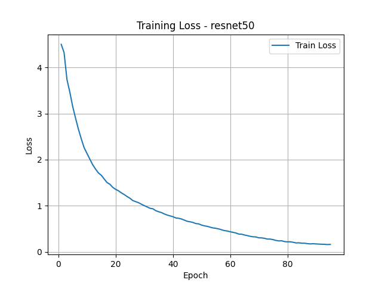 | 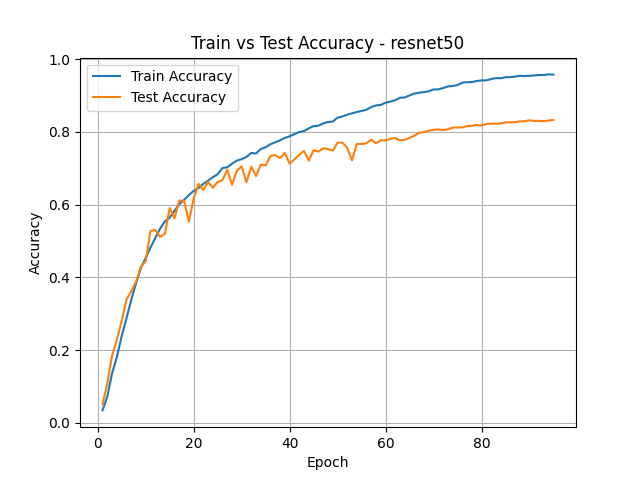 | 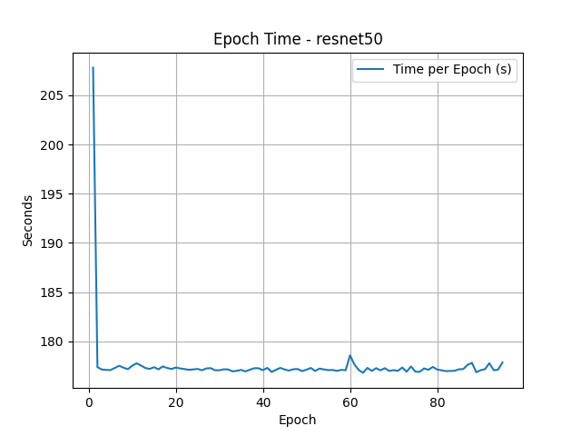 |

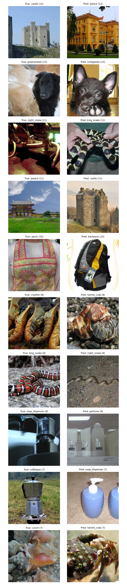

</div>

#### DenseNet-121

<div align="center">

| Loss                                                                | Accuracy                                                                    | Epoch Time                                                                      |
| ------------------------------------------------------------------- | --------------------------------------------------------------------------- | ------------------------------------------------------------------------------- |
| 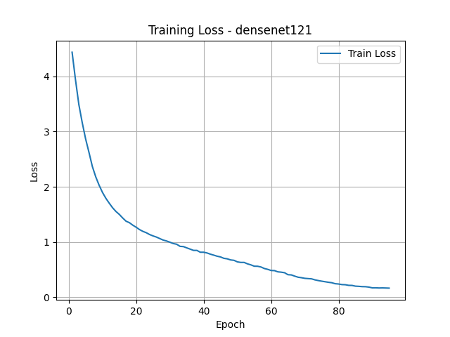 | 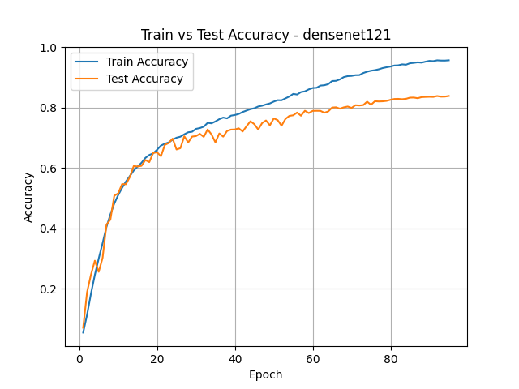 | 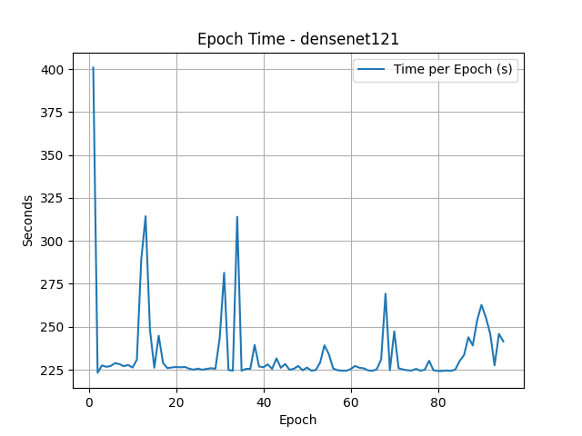 |

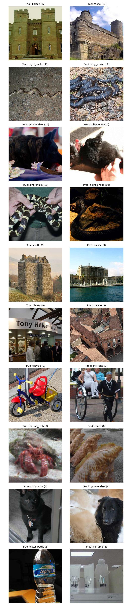

</div>

## Analysis

- **Accuracy:**
  - DenseNet-121 came out on top at **83.83%**, with ResNet-50 right behind at **83.31%**. MobileNetV4-Conv-S landed at **79.45%**, about 4 points back.
  - That's a reasonable trade. Conv-S uses 9× fewer parameters than ResNet-50 and 22× fewer MACs to give up those 4 points.
  - Top-5 is close across all three (93-95%).

- **FLOPs don't predict latency:**
  - This is the part worth paying attention to. Conv-S has 22.1× fewer MACs than ResNet-50, so you'd expect it to be roughly 22× faster. What actually happened: **9.4× at GPU batch 64, 1.3× at GPU batch 1, and 13.4× on a single CPU thread.**
  - Same two models, same hardware, three wildly different answers. At batch 1 there isn't enough parallel work to hide memory latency, so time goes to kernel launches and moving data around rather than arithmetic. The MAC advantage basically evaporates.
  - DenseNet-121 shows it even better. It has **1.4× fewer MACs and 3.4× fewer parameters** than ResNet-50, and it's still **2.5× slower at GPU batch 1** and the slowest of all three to train. All those concatenations keep intermediate tensors alive, so it's memory-bound no matter how few FLOPs it needs.
  - This is exactly what MobileNetV4 is designed around. The paper's roofline analysis aims for Pareto-optimality across hardware with very different compute-to-bandwidth ratios, rather than just minimizing FLOPs.

- **Thread scaling:**
  - ResNet-50 and DenseNet-121 both get faster going from 1 to 4 CPU threads (1.5× and 1.4×).
  - Conv-S gets **slower**: 14.8 ms to 23.3 ms. The per-layer work is small enough that thread synchronization costs more than the parallelism saves.
  - Practical takeaway: pin lightweight models to one thread for batch-1 inference.

- **Memory:**
  - Peak GPU memory at batch 64: Conv-S 293 MB, DenseNet-121 629 MB, ResNet-50 850 MB.
  - DenseNet's number is high for how few parameters it has, which is the concatenation activations again rather than weights.

- **What the models get wrong:**
  - All three trip on the same visually similar classes:
    - buildings: _castle ↔ palace_, _library → palace_
    - marine life: _conch ↔ hermit_crab_, _crayfish → hermit_crab_
    - dog breeds: _schipperke ↔ groenendael_
    - snakes: _night_snake ↔ king_snake_
  - Conv-S makes some coarser mistakes the bigger models don't (_toy_poodle → teddy_, _english_springer → saint_bernard_), which suggests the capacity it gave up specifically cost it fine-grained discrimination.

- **Training cost:**
  - Conv-S: ~1m 20s/epoch
  - ResNet-50: ~2m 58s/epoch
  - DenseNet-121: ~3m 55s/epoch, despite having 3.4× fewer params than ResNet-50

- **Takeaways:**
  - Parameter count and FLOPs are poor proxies for speed. Memory access patterns often matter more.
  - Depthwise-separable architectures pay off much more on compute-constrained hardware (CPU, mobile) than on a GPU with compute to spare.
  - If you care about latency, measure it on the hardware you're actually deploying to.

- **What I'd try next:**
  - int8 quantization, since that's the real mobile deployment path. Would show both accuracy retention and more CPU speedup.
  - Per-layer roofline analysis sweeping the compute-to-bandwidth ridge point, to reproduce the paper's hardware-independence argument analytically.
  - Stronger augmentation (RandAugment, MixUp) and longer training. The paper runs Conv-S for 9600 epochs.
  - The Hybrid variants, which add Mobile MQA attention to the final stages.
  - Official ImageNet validation set and all 1000 classes.

## Limitations

- 100 classes instead of 1000, and the test set is a holdout from the train pool rather than official val. So the accuracies aren't comparable to published numbers.
- 100 epochs against the paper's 9600, so Conv-S is heavily undertrained relative to its reported 73.8% on full ImageNet.
- Different optimizers per architecture (AdamW for MobileNetV4, SGD for the others). Standard practice, but it means this compares architecture-plus-recipe, not architecture alone.
- Kaggle gave two T4s but training and benchmarking ran on one device, so every GPU number here is single-T4.

## Running

### Local Computer

1. Prepare dataset:

```bash
python dataset.py
```

2. Train model:

```bash
python train.py conv-s
python train.py resnet50
python train.py densenet121
```

3. Run inference and benchmarks:

```bash
python inference.py
```

- Checkpoints go in `outputs/checkpoints/` (e.g., `conv-s_best.pth`).
- `python inference.py profile` runs params/MACs/latency only, no checkpoints needed.

### Kaggle Notebook

- Run the provided notebook in Kaggle or Colab (update paths if needed).
- Insert your Kaggle username where the notebook asks for it.
- First run: set `DOWNLOAD = True` to fetch and split the dataset, then upload the result as a Kaggle Dataset named **`imagenet`**.
- Later runs: add the `imagenet` dataset to the notebook and leave `DOWNLOAD = False`.
- When inferencing, upload the model checkpoints and set `CKPT_DIR` to their path.

## Reference

Qin et al., _MobileNetV4: Universal Models for the Mobile Ecosystem_, ECCV 2024. https://arxiv.org/abs/2404.10518
