# ResNet (50 / 101 / 152) Implemented from Scratch

This project implements and trains ResNet-50, ResNet-101, and ResNet-152 from scratch in PyTorch for image classification on a sports dataset.

All architectures use Bottleneck residual blocks and follow the original ResNet design.

---

## Dataset

https://www.kaggle.com/datasets/gpiosenka/sports-classification

```
data/sports/
├── train/
│   ├── archery/
│   ├── baseball/
│   └── ...
├── valid/
│   ├── archery/
│   ├── baseball/
│   └── ...
└── test/
    ├── archery/
    ├── baseball/
    └── ...
```

- Image size: 224×224
- Normalization: mean=[0.485,0.456,0.406], std=[0.229,0.224,0.225]
- Batch size: 64, 4 workers
- Classes: 100 sports categories

## Models

### ResNet Architecture

All models are implemented **from scratch** using:

- Initial 7×7 convolution (stride 2) + max pooling
- 4 residual stages
- Bottleneck blocks (1×1 → 3×3 → 1×1)
- Identity shortcut connections
- Projection shortcuts when dimensions change
- Global Average Pooling
- Fully connected classifier → `num_classes`

---

### Depth Variants

| Model      | Layers per Stage | Total Layers |
| ---------- | ---------------- | ------------ |
| ResNet-50  | [3, 4, 6, 3]     | 50           |
| ResNet-101 | [3, 4, 23, 3]    | 101          |
| ResNet-152 | [3, 8, 36, 3]    | 152          |

## Training

- Optimizer: SGD with momentum (0.9)
- Weight decay: 5e-4
- Scheduler: StepLR (decay every 30 epochs, γ = 0.1)
- Loss: CrossEntropy
- Epochs: 100
- Supports checkpoint resume (`start_from` parameter in `resnet.yaml`)

---

## Results

### ResNet-50

**Accuracy:**

- Top-1: 87.40%
- Top-5: 97.80%

**Top 10 most confused class pairs (true → predicted):**

- snow boarding → giant slalom : 3
- horseshoe pitching → frisbee : 2
- archery → bungee jumping : 1
- axe throwing → frisbee : 1
- baseball → shot put : 1
- baseball → high jump : 1
- basketball → sumo wrestling : 1
- baton twirling → tennis : 1
- baton twirling → jai alai : 1
- baton twirling → lacrosse : 1

**Training time:**

- Average epoch time: 0h 1m 19s
- Total training time: 2h 14m 1s

---

### ResNet-101

**Accuracy:**

- Top-1: 85.20%
- Top-5: 96.80%

**Top 10 most confused class pairs (true → predicted):**

- baton twirling → tennis : 2
- horseshoe pitching → frisbee : 2
- snow boarding → giant slalom : 2
- ampute football → tug of war : 1
- axe throwing → archery : 1
- barell racing → horseshoe pitching : 1
- baseball → shot put : 1
- baseball → cricket : 1
- baseball → football : 1
- basketball → sumo wrestling : 1

**Training time:**

- Average epoch time: 0h 2m 2s
- Total training time: 3h 26m 28s

---

### ResNet-152

**Accuracy:**

- Top-1: 86.00%
- Top-5: 96.40%

**Top 10 most confused class pairs (true → predicted):**

- baton twirling → tennis : 2
- bungee jumping → trapeze : 2
- horseshoe pitching → frisbee : 2
- archery → trapeze : 1
- axe throwing → frisbee : 1
- barell racing → horseshoe pitching : 1
- baseball → cricket : 1
- baseball → football : 1
- bmx → sky surfing : 1
- bmx → bobsled : 1

**Training time:**

- Average epoch time: 0h 2m 48s
- Total training time: 4h 40m 37s

## Inference & Outputs

Each model reports:

- Top-1 accuracy
- Top-5 accuracy
- Top 10 most confused class pairs
- Confusion bar plot
- Sample images of confused pairs
- Per-class accuracy CSV
- Loss plot
- Accuracy plot
- Epoch time plot

---

### Saved files:

```
outputs/
├── plots/
│   ├── resnet50_loss.png
│   ├── resnet50_accuracy.png
│   ├── resnet50_epoch_time.png
│   ├── resnet50_most_confused_pairs.png
│   └── resnet50_most_confused_pairs_samples.png
└── metrics/
    └── resnet50_per_class_accuracy.csv
```

## Plots

### ResNet-50

<div align="center">

| Loss                                              | Accuracy                                                  | Epoch Time                                                    |
| ------------------------------------------------- | --------------------------------------------------------- | ------------------------------------------------------------- |
| 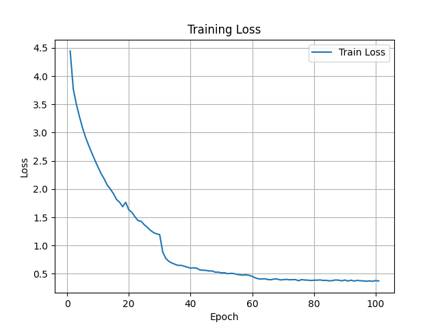 | 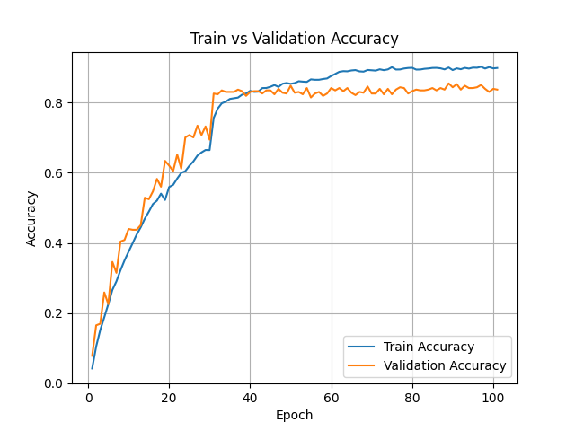 | 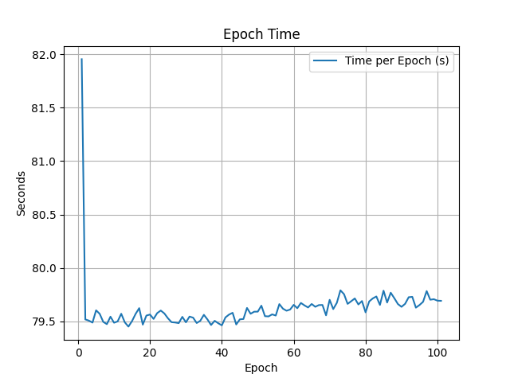 |

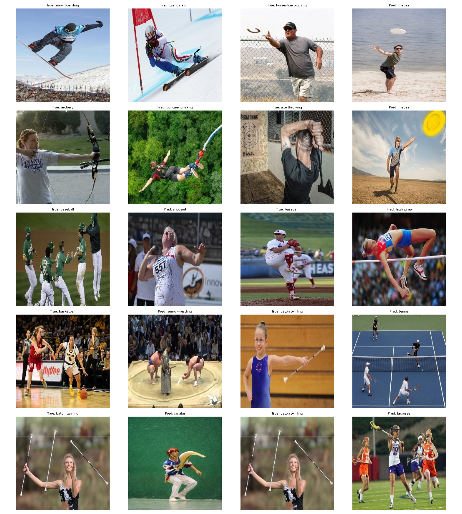

</div>

### ResNet-101

<div align="center">

| Loss                                                | Accuracy                                                    | Epoch Time                                                      |
| --------------------------------------------------- | ----------------------------------------------------------- | --------------------------------------------------------------- |
| 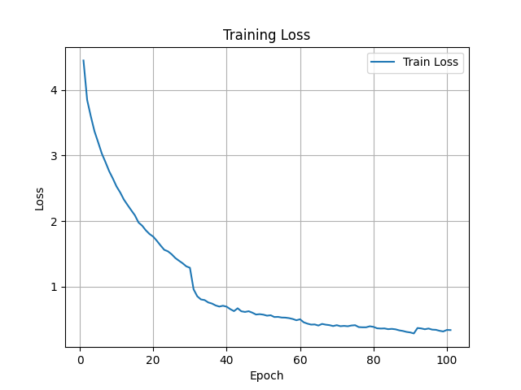 | 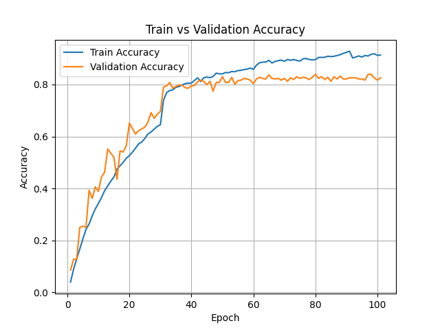 | 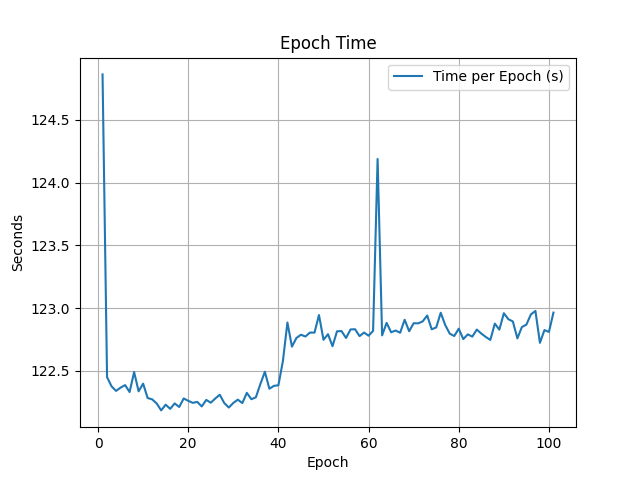 |

The two images on the left form one pair, and the two images on the right form another pair.  
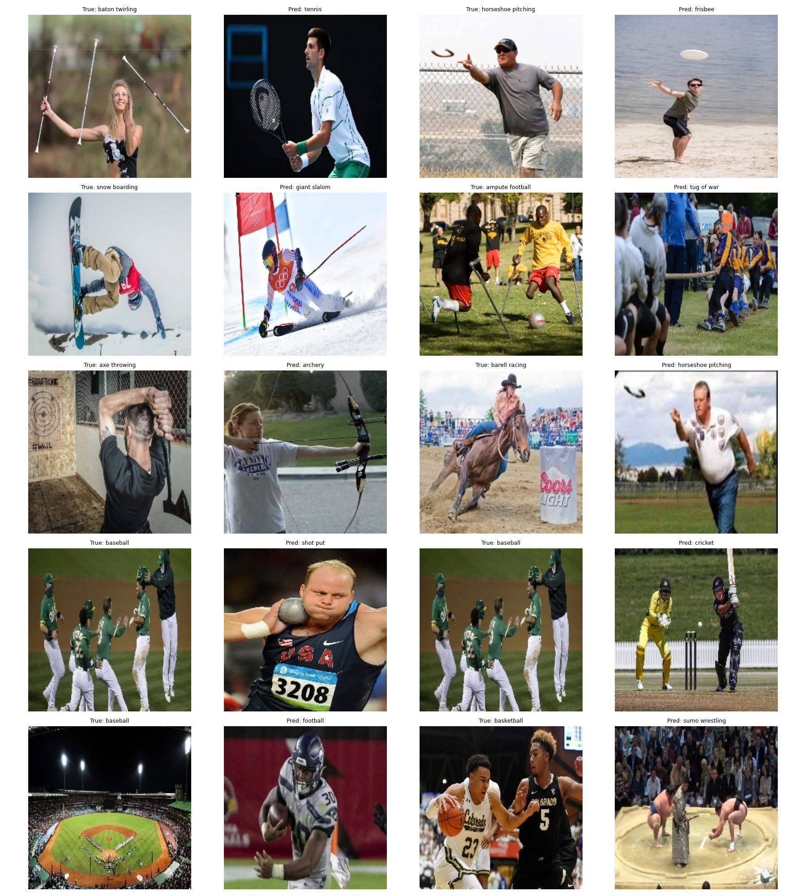

</div>

### ResNet-152

<div align="center">

| Loss                                                | Accuracy                                                    | Epoch Time                                                      |
| --------------------------------------------------- | ----------------------------------------------------------- | --------------------------------------------------------------- |
| 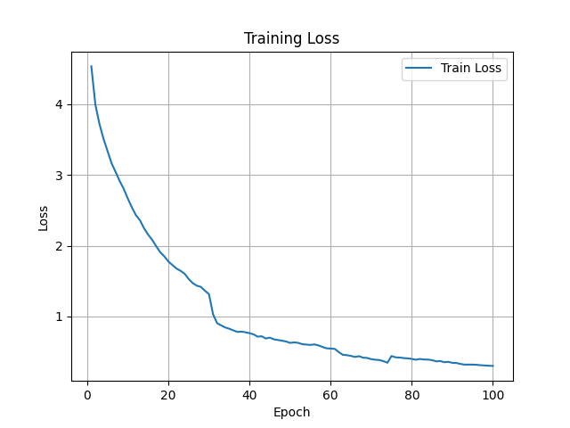 |  | 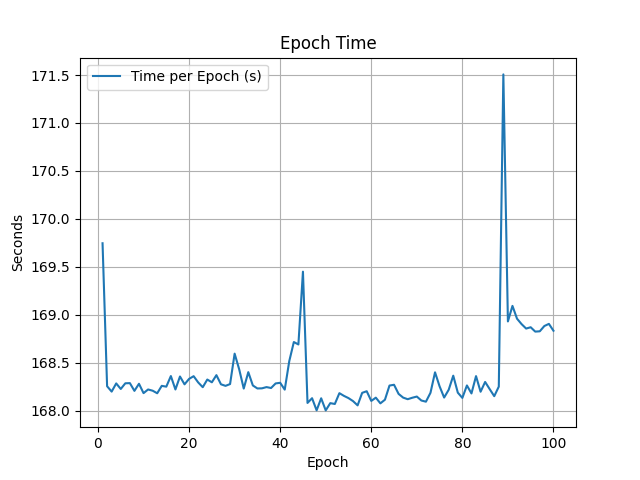 |

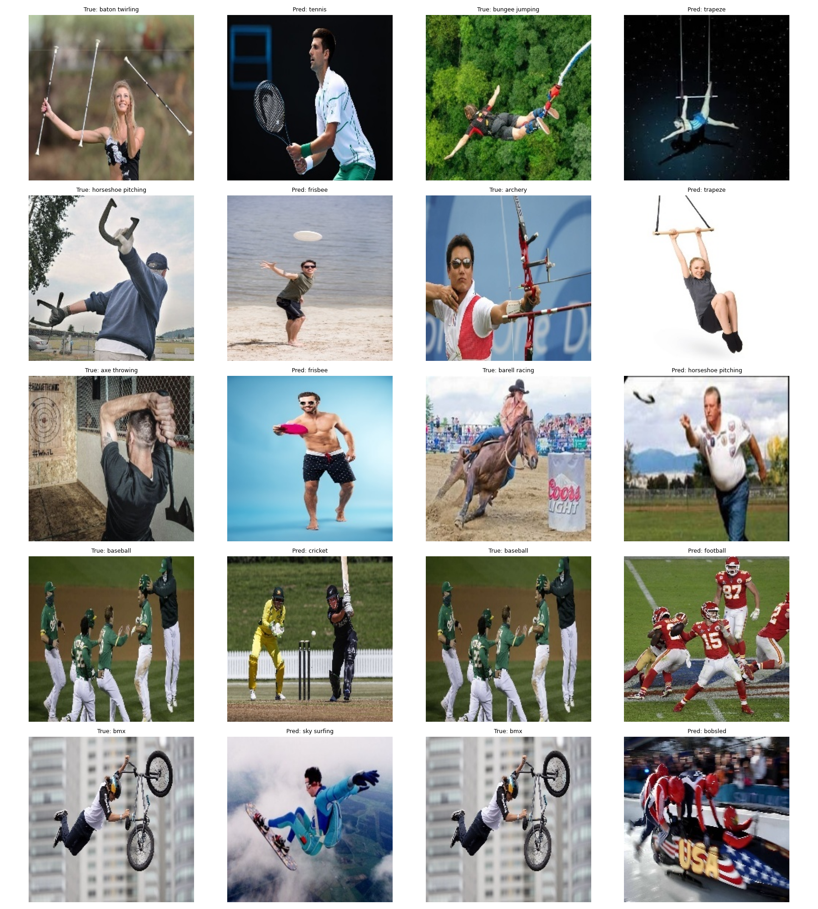

</div>

---

## Analysis

- **Best Accuracy:** ResNet-50 achieved the highest Top-1 accuracy (87.40%).
- **Depth vs Performance:** Deeper models (ResNet-101 and 152) performed worse (85.20% and 86.00%), indicating increasing depth did not help on this dataset.
- **Training Efficiency:** ResNet-50 was fastest (2h 14m) compared to ResNet-152 (4h 40m).
- **Learning Rate Impact:** Sharp improvements occur at Epoch 30, coinciding with StepLR decay.
- **Overfitting:** After Epoch 40, a gap between training and validation accuracy grows, showing overfitting tendencies.
- **Shared Confusions:** All models confused visually similar classes, e.g., snow boarding ↔ giant slalom, horseshoe pitching ↔ frisbee, baton twirling ↔ tennis.

### Why ResNet-50 Performed Best

- **Optimal Capacity:** ResNet-50 is deep enough to learn features without overfitting. Larger models may memorize noise instead of learning generalized patterns.
- **Training Stability:** ResNet-50’s loss remained consistent, while ResNet-152 showed spikes near Epoch 75.

### Potential Improvements

- **Data Augmentation:** Mixup, CutMix, and additional rotations could help distinguish visually similar sports.
- **Regularization:** Adding dropout or label smoothing can reduce overfitting.
- **Learning Rate Scheduling:** Cosine annealing could improve convergence rather than step-wise decay.

## Running

### Local Computer

1. Prepare dataset:

```bash
python dataset.py
```

2. Train model:

At the bottom of your training script, make sure to specify the model you want to train (resnet50, resnet101, or resnet152):

```bash
python train.py
```

3. Run inference:

```bash
python inference.py
```

- Make sure to set the correct parameter file for the model you trained (e.g., `resnet50_epoch_100.pth`).

### Kaggle Notebook

- Or run the provided notebook in Kaggle or Colab (update paths if needed).
- Create a dataset named `resnet` with the two config yaml files. Or simply upload it if on Colab.
- When inferencing, initialize a model named `ResNet` and upload the corresponding model checkpoint parameters.
