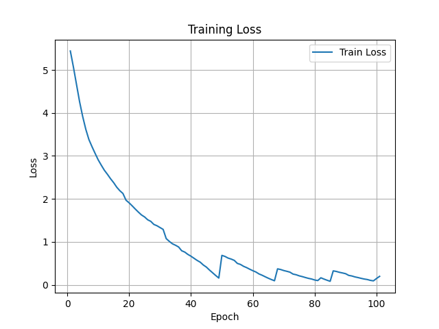
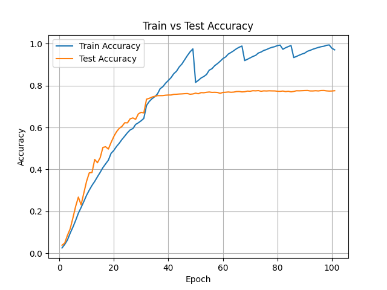
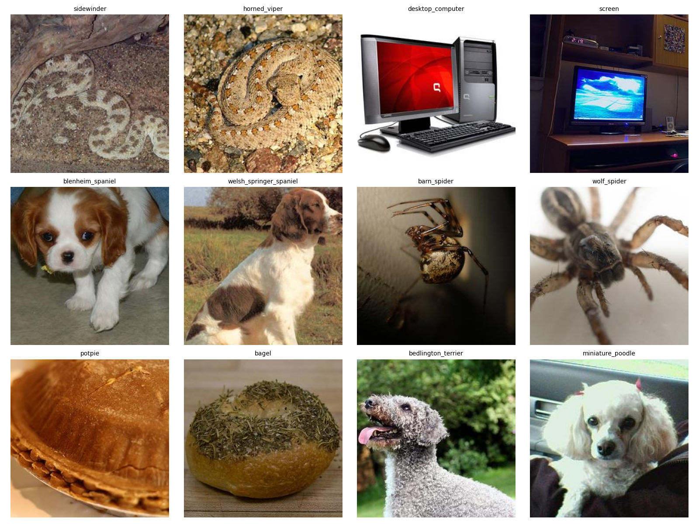

# VGG16 Implemented from Scratch

This project implements and trains a VGG16-style CNN in PyTorch for image classification on an ImageNet-style dataset.

---

## Dataset

- ImageNet-style folder structure:

```py
data/imagenet/
├── train/
│ ├── abacus/
│ ├── abaya/
│ └── ...
└── test/
├── abacus/
├── abaya/
└── ...
```

- Image size: 224×224
- Normalization: mean=[0.485,0.456,0.406], std=[0.229,0.224,0.225]
- Batch size: 64, 4 workers
- Classes: 100 (to reduce computation)

---

## Model

- VGG16 with BatchNorm
- 5 convolutional blocks with MaxPooling
- Fully connected layers: 4096 → 4096 → num_classes
- ReLU + Dropout + BatchNorm

---

## Training

- Optimizer: SGD with momentum
- Scheduler: StepLR (decay every 30 epochs)
- Loss: CrossEntropy
- Epochs: 100
- Can resume from checkpoint (`start_from` parameter)

---

## Inference & Results

- Reports **Top-1** and **Top-5** accuracy
- Shows **top 10 most confused class pairs**
- Saves **loss plot**: `outputs/plots/loss.png`
- Saves **accuracy plot**: `outputs/plots/accuracy.png`
- Saves **epoch time plot**: `outputs/plots/epoch_time.png`
- Saves **confusion plot**: `outputs/plots/most_confused_pairs.png`
- Saves **sample images of most confused pairs**: `outputs/plots/most_confused_pairs_samples.png`
- Saves **per-class accuracy CSV**: `outputs/metrics/per_class_accuracy.csv`

**Example Output:**

Top-1: 77.55%

Top-5: 93.58%

Top 10 most confused class pairs (true -> predicted):

- maillot -> tank_suit : 35
- tank_suit -> maillot : 26
- sidewinder -> horned_viper : 25
- horned_viper -> sidewinder : 21
- desktop_computer -> screen : 19
- blenheim_spaniel -> welsh_springer_spaniel : 18
- maillot -> bikini : 16
- barn_spider -> wolf_spider : 15
- potpie -> bagel : 12
- bedlington_terrier -> miniature_poodle : 11

**Training time:**

- Average epoch time: 0h 6m 49s
- Total training time: 11h 29m 33s

**Plots:**

- Loss plot: `outputs/plots/loss.png`  
  

- Accuracy plot: `outputs/plots/accuracy.png`  
  

- Epoch time plot: `outputs/plots/epoch_time.png`  
  

- Sample images of most confused pairs: `outputs/plots/most_confused_pairs_samples.png`  
  

---

## Running

### Local Computer

1. Prepare dataset:

```bash
python dataset.py
```

2. Train model:

```bash
python train.py
```

3. Run inference:

```bash
python inference.py
```

### Kaggle Notebook

- Or run the provided notebook in Kaggle or Colab (update paths if needed).
- Modify `DOWNLOAD` variable to prepare the dataset or skip downloading.
- Once processed, you can download and create your own dataset.
