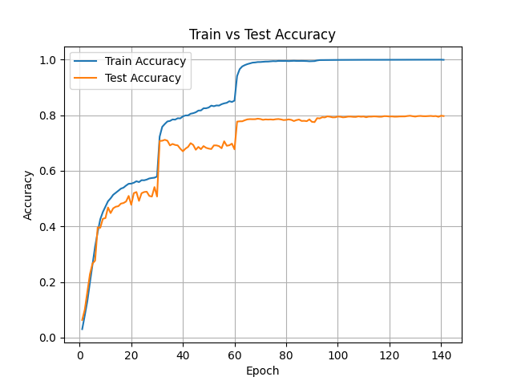
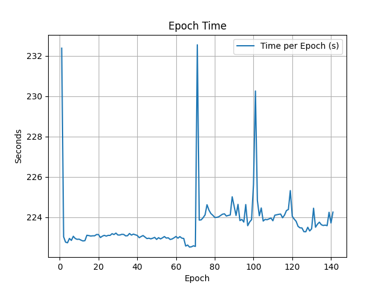
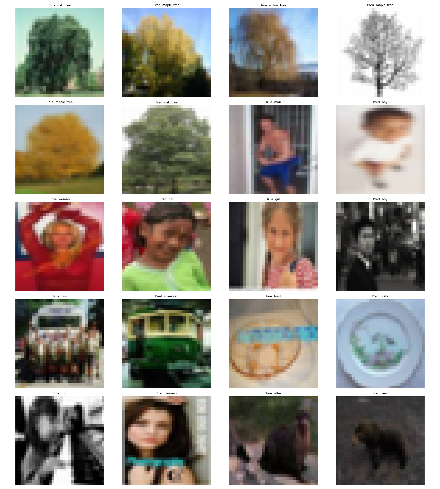

# Wide ResNet (WRN-28-10) Implemented from Scratch

This project implements and trains **Wide ResNet (WRN-28-10)** from scratch in PyTorch for image classification.

The architecture follows the Wide Residual Network design, which increases the width of residual blocks instead of simply increasing depth.

---

## Dataset

https://www.kaggle.com/datasets/melikechan/cifar100

CIFAR-100
```
data/cifar100/
├── train/
│   ├── apple/
│   ├── aquarium_fish/
│   └── ...
└── test/
    ├── apple/
    ├── aquarium_fish/
    └── ...
```

- Image size: 32×32 (typical WRN input)
- Normalization: mean=[0.5071,0.4867,0.4408], std=[0.2675,0.2565,0.2761]
- Batch size: 64, 4 workers
- Classes: 100 classes

## Model

### WRN Architecture

- Initial convolutional layer
- 3 wide residual stages (width factor = 10)
- Dropout in residual blocks
- Identity and projection shortcuts
- Global Average Pooling
- Fully connected classifier → `num_classes`

---

### Depth & Width

| Model     | Depth | Width Factor |
| --------- | ----- | ------------ |
| WRN-28-10 | 28    | 10           |

## Training

- Optimizer: SGD with momentum (0.9)
- Weight decay: 5e-4
- Scheduler: StepLR (decay every 30 epochs, γ = 0.2)
- Loss: CrossEntropy
- Epochs: 140
- Supports checkpoint resume (`start_from` parameter in `wrn.yaml`)

---

## Results

### WRN-28-10

**Accuracy:**

- Top-1: 79.82%
- Top-5: 94.76%

**Top 10 most confused class pairs (true → predicted):**

- oak_tree → maple_tree : 20
- willow_tree → maple_tree : 18
- maple_tree → oak_tree : 18
- man → boy : 17
- woman → girl : 16
- girl → boy : 15
- bus → streetcar : 14
- bowl → plate : 14
- girl → woman : 13
- otter → seal : 11

**Training time:**

- Average epoch time: 0h 3m 43s
- Total training time: 8h 41m 54s

---

## Inference & Outputs

Each model reports:

- Top-1 accuracy
- Top-5 accuracy
- Top 10 most confused class pairs
- Confusion bar plot
- Sample images of confused pairs
- Per-class accuracy CSV
- Loss plot
- Accuracy plot
- Epoch time plot

### Saved files:

```
outputs/
├── plots/
│ ├── wrn28_10_most_confused_pairs.png
│ └── wrn28_10_most_confused_pairs_samples.png
└── metrics/
  └── wrn28_10_per_class_accuracy.csv
```

---

### Plots

<div align="center">

| Loss                                               | Accuracy                                                   | Epoch Time                                                     |
| -------------------------------------------------- | ---------------------------------------------------------- | -------------------------------------------------------------- |
|  |  |  |



</div>

---

## Analysis

- **Top-1 Accuracy:** 79.82%, Top-5 Accuracy: 94.76%
- **Confusions:** Most confusions occur between visually similar classes, e.g., oak_tree ↔ maple_tree, man ↔ boy, girl ↔ boy.
- **Training Efficiency:** Average epoch time 3m 43s; total training time 8h 41m 54s.
- **Potential Improvements:** Data augmentation, label smoothing, and learning rate tuning could further improve performance.

## Future Task

- Train ResNet with CIFAR100
 
---

## Running

### Local Computer

1. Prepare dataset:

```bash
python dataset.py
```

2. Train model:

```bash
python train.py
```

3. Run inference:

```bash
python inference.py
```

- Make sure to set the correct checkpoint file (e.g., `wrn28_10_epoch_140.pth`).

### Kaggle Notebook

- Or run the provided notebook in Kaggle or Colab (update paths if needed).
- Create a dataset named `wide resnet` with the two yaml files. Or simply upload it if on Colab.
- When inferencing, initialize a model named `wrn` and upload the corresponding model checkpoint parameters.
