# Wide ResNet (WRN-28-10) Implemented from Scratch

This project implements and trains **Wide ResNet (WRN-28-10)** from scratch in PyTorch for image classification on CIFAR-100.

The architecture follows the Wide Residual Network design, which improves performance by increasing the **width of residual blocks** rather than simply going deeper.

In addition, we include a comparative study with **ResNet variants (ResNet-50, ResNet-101, ResNet-152)** to analyze the trade-offs between **width and depth**, focusing on accuracy, training efficiency, and computational cost.

---

## Dataset

https://www.kaggle.com/datasets/melikechan/cifar100

CIFAR-100
```
data/cifar100/
├── train/
│   ├── apple/
│   ├── aquarium_fish/
│   └── ...
└── test/
    ├── apple/
    ├── aquarium_fish/
    └── ...
```

- Image size: 32×32 (typical WRN input)
- Normalization: mean=[0.5071,0.4867,0.4408], std=[0.2675,0.2565,0.2761]
- Batch size: 64, 4 workers
- Classes: 100 classes

## Model

### WRN Architecture

- Initial convolutional layer
- 3 wide residual stages (width factor = 10)
- Dropout in residual blocks
- Identity and projection shortcuts
- Global Average Pooling
- Fully connected classifier → `num_classes`

---

### Depth & Width

| Model     | Depth | Width Factor |
| --------- | ----- | ------------ |
| WRN-28-10 | 28    | 10           |

## Training

- Optimizer: SGD with momentum (0.9)
- Weight decay: 5e-4
- Scheduler: StepLR (decay every 30 epochs, γ = 0.2)
- Loss: CrossEntropy
- Epochs: 140
- Supports checkpoint resume (`start_from` parameter in `wrn.yaml`)

---

## Results

### WRN-28-10

**Accuracy:**

- Top-1: 79.82%
- Top-5: 94.76%

**Top 10 most confused class pairs (true → predicted):**

- oak_tree → maple_tree : 20
- willow_tree → maple_tree : 18
- maple_tree → oak_tree : 18
- man → boy : 17
- woman → girl : 16
- girl → boy : 15
- bus → streetcar : 14
- bowl → plate : 14
- girl → woman : 13
- otter → seal : 11

**Training time:**

- Average epoch time: 0h 3m 43s
- Total training time: 8h 41m 54s


### ResNet-50

**Accuracy:**

- Top-1: 77.40%
- Top-5: 93.39%

**Top 10 most confused class pairs (true → predicted):**

- oak_tree → maple_tree : 25
- girl → woman : 17
- willow_tree → maple_tree : 16
- boy → man : 14
- maple_tree → oak_tree : 14
- woman → girl : 13
- pine_tree → oak_tree : 12
- boy → girl : 11
- otter → seal : 11
- maple_tree → willow_tree : 11

**Training time:**

- Average epoch time: 0h 1m 55s
- Total training time: 4h 29m 29s


### ResNet-101

**Accuracy:**

- Top-1: 78.96%
- Top-5: 94.23%

**Top 10 most confused class pairs (true → predicted):**

- plate → bowl : 18
- girl → woman : 18
- oak_tree → maple_tree : 17
- pine_tree → oak_tree : 16
- man → boy : 15
- otter → seal : 14
- boy → girl : 13
- maple_tree → oak_tree : 13
- willow_tree → maple_tree : 12
- dolphin → shark : 12

**Training time:**

- Average epoch time: 0h 2m 57s
- Total training time: 6h 55m 12s


### ResNet-152

**Accuracy:**

- Top-1: 78.87%
- Top-5: 94.28%

**Top 10 most confused class pairs (true → predicted):**

- oak_tree → maple_tree : 18
- girl → woman : 18
- pine_tree → oak_tree : 17
- woman → girl : 16
- willow_tree → maple_tree : 15
- man → boy : 14
- man → woman : 13
- otter → seal : 13
- maple_tree → oak_tree : 13
- boy → man : 12

**Training time:**

- Average epoch time: 0h 4m 3s
- Total training time: 9h 29m 17s

---

## Inference & Outputs

Each model reports:

- Top-1 accuracy
- Top-5 accuracy
- Top 10 most confused class pairs
- Confusion bar plot
- Sample images of confused pairs
- Per-class accuracy CSV
- Loss plot
- Accuracy plot
- Epoch time plot

### Saved files:

```
### Saved files:

outputs/
├── plots/
│   ├── wrn/
│   │   ├── wrn28_10_loss.png
│   │   ├── wrn28_10_accuracy.png
│   │   ├── wrn28_10_epoch_time.png
│   │   ├── wrn28_10_most_confused_pairs.png
│   │   └── wrn28_10_most_confused_pairs_samples.png
│   ├── resnet50/
│   │   ├── resnet50_loss.png
│   │   ├── resnet50_accuracy.png
│   │   ├── resnet50_epoch_time.png
│   │   ├── resnet50_most_confused_pairs.png
│   │   └── resnet50_most_confused_pairs_samples.png
│   ├── resnet101/
│   │   ├── resnet101_loss.png
│   │   ├── resnet101_accuracy.png
│   │   ├── resnet101_epoch_time.png
│   │   ├── resnet101_most_confused_pairs.png
│   │   └── resnet101_most_confused_pairs_samples.png
│   └── resnet152/
│       ├── resnet152_loss.png
│       ├── resnet152_accuracy.png
│       ├── resnet152_epoch_time.png
│       ├── resnet152_most_confused_pairs.png
│       └── resnet152_most_confused_pairs_samples.png
└── metrics/
    ├── wrn28_10_per_class_accuracy.csv
    ├── resnet50_per_class_accuracy.csv
    ├── resnet101_per_class_accuracy.csv
    └── resnet152_per_class_accuracy.csv
```

---

### Plots

#### Wide Residual Network (28, 10)
<div align="center">

| Loss                                               | Accuracy                                                   | Epoch Time                                                     |
| -------------------------------------------------- | ---------------------------------------------------------- | -------------------------------------------------------------- |
| 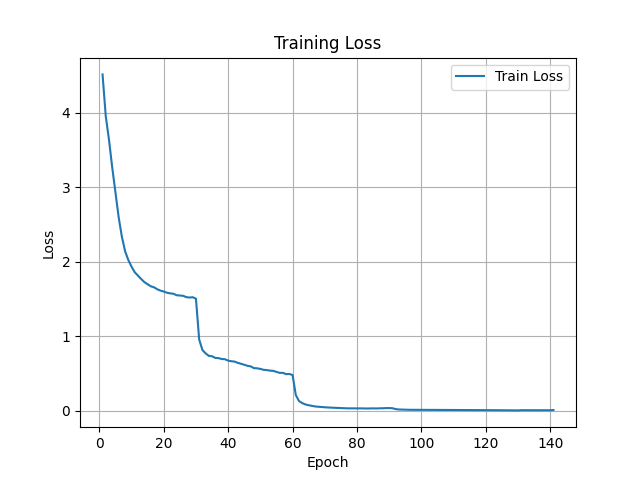 |  |  |


</div>


#### ResNet50
<div align="center">

| Loss | Accuracy | Epoch Time |
| ---- | -------- | ---------- |
| 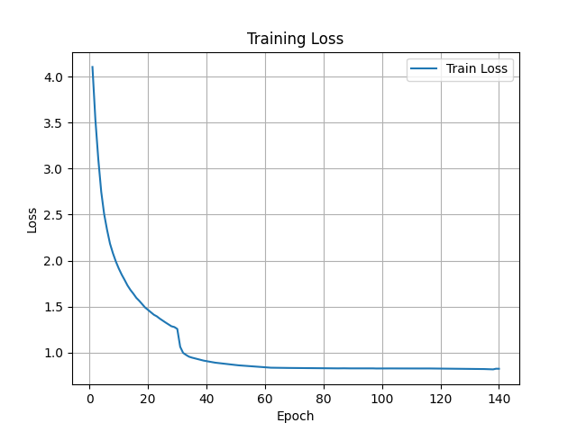 | 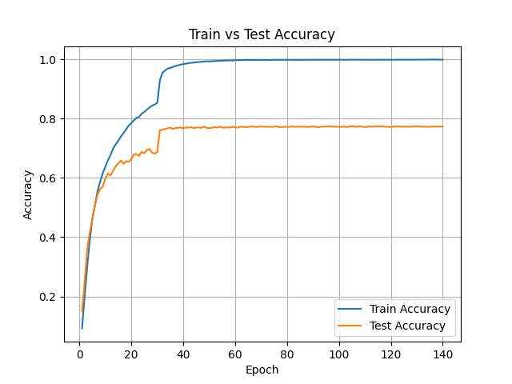 | 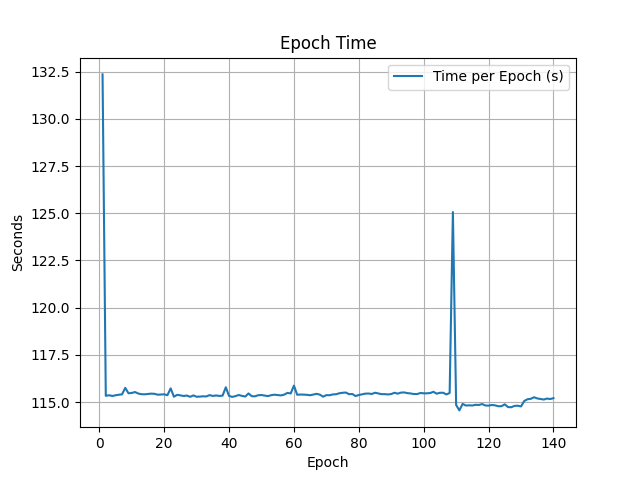 |

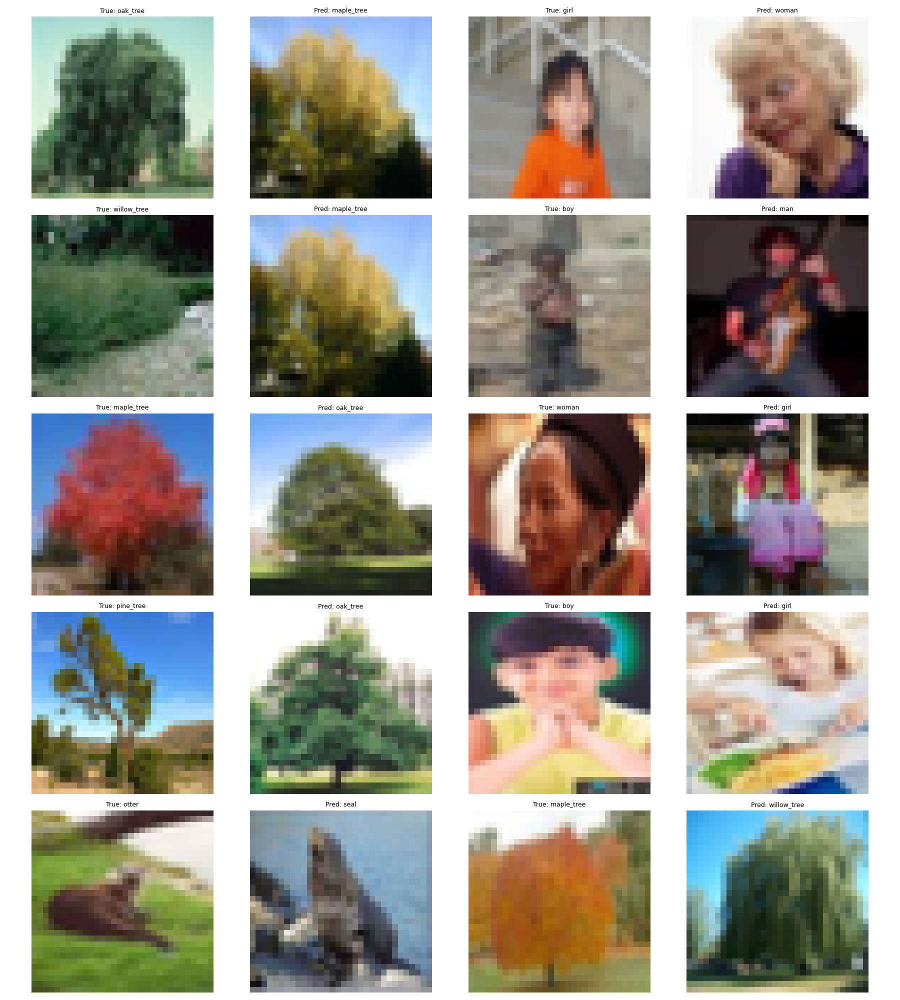

</div>


#### ResNet101
<div align="center">

| Loss | Accuracy | Epoch Time |
| ---- | -------- | ---------- |
| 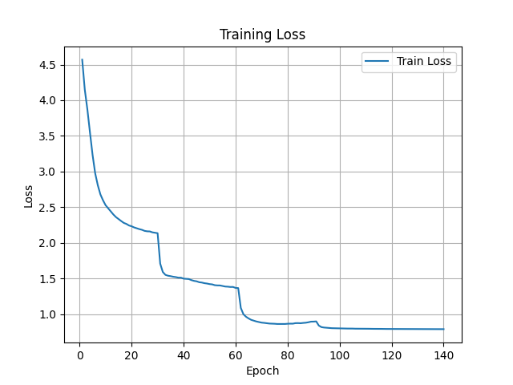 | 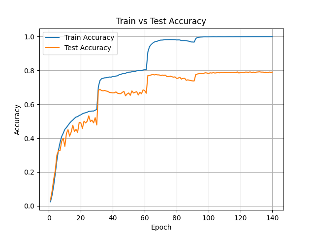 | 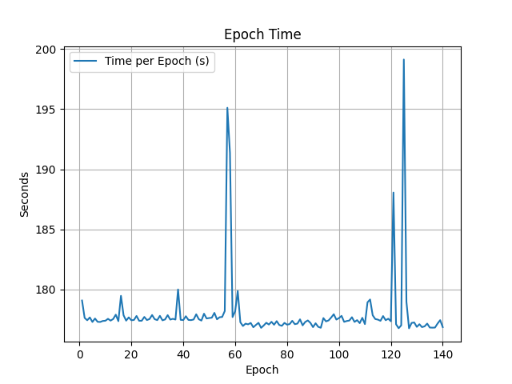 |

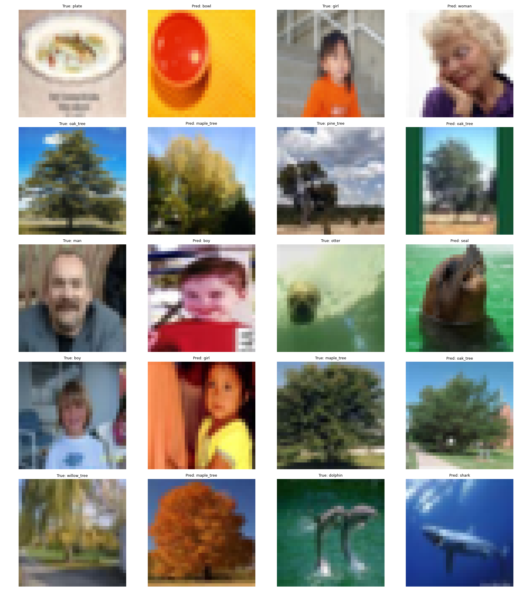

</div>


#### ResNet152
<div align="center">

| Loss | Accuracy | Epoch Time |
| ---- | -------- | ---------- |
|  | 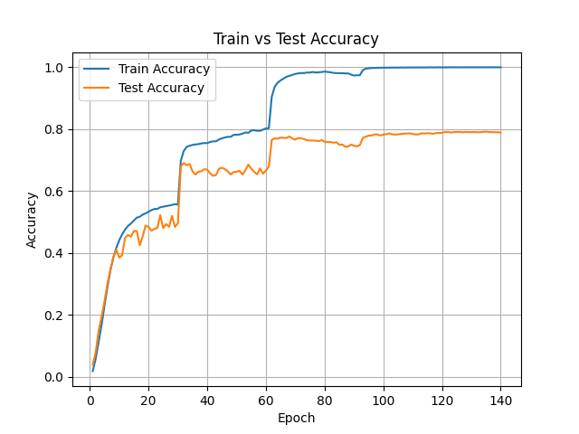 | 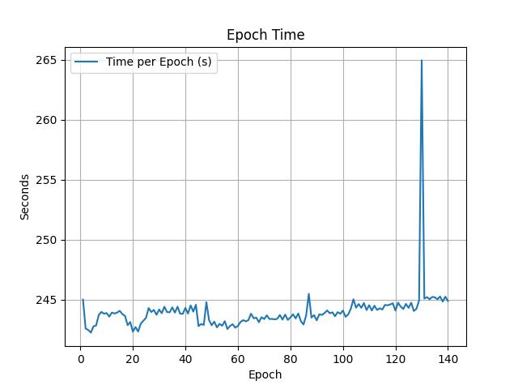 |

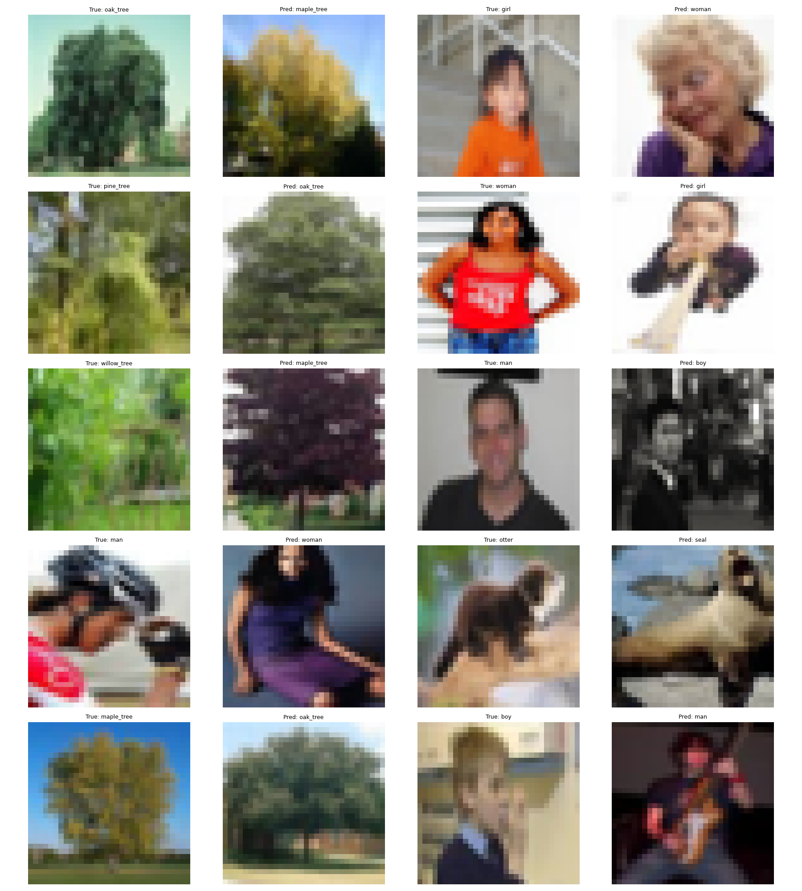

</div>

---

## Analysis

- **Overall Accuracy:**
  - WRN-28-10 achieves the highest Top-1 accuracy at **79.82%**, followed by ResNet-101 (**78.96%**) and ResNet-152 (**78.87%**), with ResNet-50 slightly lower (**77.40%**).
  - Top-5 accuracy is consistently strong across all models (~93–95%), with WRN-28-10 performing best (**94.76%**).

- **Model Comparison:**
  - WRN-28-10 outperforms deeper ResNet variants despite having fewer layers, highlighting the effectiveness of wider architectures on CIFAR-100.
  - Increasing depth from ResNet-50 → ResNet-101 improves performance, but gains saturate from ResNet-101 → ResNet-152.
  - ResNet-152 incurs significantly higher training cost without meaningful accuracy improvement over ResNet-101.

- **Confusion Patterns:**
  - All models consistently struggle with visually similar classes:
    - tree classes: *oak_tree ↔ maple_tree ↔ willow_tree*
    - human classes: *man ↔ boy*, *woman ↔ girl*
    - animal classes: *otter ↔ seal*
  - These recurring errors suggest limitations in fine-grained feature discrimination rather than model capacity alone.

- **Training Efficiency:**
  - WRN-28-10: ~3m 43s/epoch (8h 41m total)
  - ResNet-50: fastest (~1m 55s/epoch, 4h 29m total)
  - ResNet-101: moderate (~2m 57s/epoch, 6h 55m total)
  - ResNet-152: slowest (~4m 3s/epoch, 9h 29m total)
  - There is a clear trade-off between depth and computational cost, with diminishing accuracy returns for deeper ResNets.

- **Key Takeaways:**
  - Wider architectures (WRN) are more efficient than deeper ones (ResNet) for CIFAR-100.
  - Scaling depth alone is not sufficient; architectural design plays a crucial role.
  - Most remaining errors are due to class similarity, indicating a need for better feature separation.

- **Potential Improvements:**
  - Stronger data augmentation (e.g., CutMix, MixUp)
  - Label smoothing
  - Learning rate scheduling (Cosine Annealing / OneCycle)
  - Fine-grained regularization or attention mechanisms
  - Class-specific augmentation for commonly confused categories
 
---

## Running

### Local Computer

1. Prepare dataset:

```bash
python dataset.py
```

2. Train model:

```bash
python train.py
```

3. Run inference:

```bash
python inference.py
```

- Make sure to set the correct checkpoint file (e.g., `wrn28_10_epoch_140.pth`).

### Kaggle Notebook

- Or run the provided notebook in Kaggle or Colab (update paths if needed).
- Create a dataset named `wide resnet` with the three yaml files. Or simply upload it if on Colab.
- When inferencing, initialize a model named `wrn` and upload the corresponding model checkpoint parameters.
